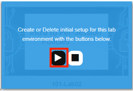
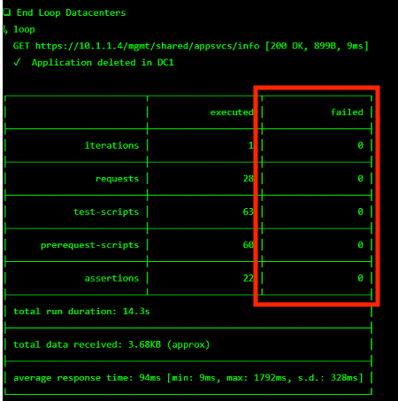

Lab 2: Access Profile  & Visual Policy Editor Overview
========================================================

Setup Lab Environment
-----------------------------------

To access your dedicated student lab environment, you will require a web browser and Remote Desktop Protocol (RDP) client software. The web browser will be used to access the Lab Training Portal. The RDP client will be used to connect to the Jump Host, where you will be able to access the BIG-IP management interfaces (HTTPS, SSH).

#. Click **DEPLOYMENT** located on the top left corner to display the environment

#. Click **ACCESS** next to jumpohost.f5lab.local

   |image001|

#. Select your RDP solution.  

#. The RDP client on your local host establishes a RDP connection to the Jump Host.

#. Login with the following credentials:

         - User: **f5lab\\user1**
         - Password: **user1**

#. After successful logon the Chrome browser will auto launch opening the site https://portal.f5lab.local.  This process usually takes 30 seconds after logon.

#. Click the **Classes** tab at the top of the page.

	|image002|

#. Scroll down the page until you see **101 Intro to Access Foundational Concepts** on the left

   |image003|

#. Hover over tile **Visual Policy Editor(VPE) Overview**. A start and stop icon should appear within the tile.  Click the **Play** Button to start the automation to build the environment

   |image004|

#. The screen should refresh displaying the progress of the automation within 30 seconds.  Scroll to the bottom of the automation workflow to ensure all requests succeeded.  If you you experience errors try running the automation a second time or open an issue on the `Access Labs Repo <https://github.com/f5devcentral/access-labs>`__.

   |image005|

Section 1 - The Access Profile
------------------------------

#. From a browser navigate to https://bigip1.f5lab.local

#. Login with username **admin** and password **admin**

    |image006|

#. Navigate to Access >> Profiles/Policies >> Access Profiles (Per-Session Policies).

    |image007|

#. The **Status** flag indicates if there are changed pending to the policy.  When the flag is yellow there are changes pending to the policy.  We will interact with **Pending Changes** later in the lab.

    |image008|

#. Click **server1-psp**

    |image009|

#. The **Properties** section provides baseline settings related to Scope, timers, and languages accross the all sessions that will use the policy regardless of how Visual Policy Editor is configured.  

    |image010|

+-------------------------+-------------------------+--------------------------------------------------------------------------------------------------------------------+
| Setting                 | Value                   | Description and defaults                                                                                           | 
+=========================+=========================+====================================================================================================================+
| Name                    | text                    | Specifies the name of the access profile.                                                                          | 
+-------------------------+-------------------------+--------------------------------------------------------------------------------------------------------------------+
| Inactivity Timeout      | Number of seconds, or 0 | Specifies the inactivity timeout for the connection. If there is no activity between the client and server within  |
|                         |                         | the specified threshold time, the system closes the current session. By default, the threshold is 0, which         |
|                         |                         | specifies that as long as a connection is established, the inactivity timeout is inactive. However, if an          |
|                         |                         | inactivity timeout value is set, when server traffic exceeds the specified threshold, the inactivity timeout is    |
|                         |                         | reset.                                                                                                             |
+-------------------------+-------------------------+--------------------------------------------------------------------------------------------------------------------+
| Access Policy Timeout   | Number of seconds, or 0 | Designed to keep malicious users from creating a denial-of-service (DoS) attack on your server. The timeout        |
|                         |                         | requires that a user, who has followed through on a redirect, must reach the webtop before the timeout expires.    |
|                         |                         | The default value is 300 seconds.                                                                                  |
+-------------------------+-------------------------+--------------------------------------------------------------------------------------------------------------------+
| Maximum Session Timeout | Number of seconds, or 0 | The maximum lifetime is from the time a session is created, to when the session terminates. By default, it is set  |
|                         |                         | to 0, which means no limit. When you configure a maximum session timeout setting other than 0, there is no way to  |
|                         |                         | extend the session lifetime, and the user must log out and then log back in to the server when the session expires.|
+-------------------------+-------------------------+--------------------------------------------------------------------------------------------------------------------+
| Max Concurrent Users    | Number of users, or 0   | The number of sessions allowed at one time for this access profile. The default value is 0 which specifies         |
|                         |                         | unlimited sessions.                                                                                                |
+-------------------------+-------------------------+--------------------------------------------------------------------------------------------------------------------+
| Max Sessions Per User   | Number between 1 and    | Specifies the number of sessions for one user that can be active concurrently. The default value is 0, which       |
|                         | 1000, or 0              | specifies unlimited sessions. You can set a limit from 1-1000. Values higher than 1000 cause the access profile    |
|                         |                         | to fail.                                                                                                           |
+-------------------------+-------------------------+--------------------------------------------------------------------------------------------------------------------+
| Max In Progress Sessions| Number 0 or greater     | Specifies the maximum number of sessions that can be in progress for a client IP address. When setting this value, |
| Per Client IP           |                         | take into account whether users will come from a NAT-ed or proxied client address and, if so, consider increasing  |
|                         |                         | the value accordingly. The default value is 0 which represents unlimited sessions.                                 |                                                                                                          |
+-------------------------+-------------------------+--------------------------------------------------------------------------------------------------------------------+
| Restrict to Single      | Selected or cleared     | When selected, limits a session to a single IP address.                                                            |                                                            
| Client IP               |                         |                                                                                                                    |
+-------------------------+-------------------------+--------------------------------------------------------------------------------------------------------------------+
| Logout URI Include      | One or more URIs        | Specifies a list of URIs to include in the access profile to initiate session logout.                              |                                                            
|                         |                         |                                                                                                                    |
+-------------------------+-------------------------+--------------------------------------------------------------------------------------------------------------------+
| Logout URI Timeout      | Logout delay URI in     | Specifies the time delay before the logout occurs, using the logout URIs defined in the logout URI include list.   |                                                            
|                         | seconds                 |                                                                                                                    |
+-------------------------+-------------------------+--------------------------------------------------------------------------------------------------------------------+

#. Click **SSO/Auth Domains**

    |image011|

+-------------------------+-------------------------+--------------------------------------------------------------------------------------------------------------------+
| Setting                 | Value                   | Description and defaults                                                                                           | 
+=========================+=========================+====================================================================================================================+
| Domain Mode             | Single Domain or        | Select Single Domain to apply your SSO configuration to a single domain. Select Multiple Domain to apply your SSO  |
|                         | Multiple Domains        | configuration across multiple domains. This is useful in cases where you want to allow your users a single Access  |
|                         |                         | Policy Manager® (APM®) login session and apply it across multiple Local Traffic Manager™ or APM virtual servers,   |                                                   
|                         |                         | front-ending different domains.                                                                                    |
+-------------------------+-------------------------+--------------------------------------------------------------------------------------------------------------------+
| Domain Cookie           | A Domain Cookie         | If you specify a domain cookie, then the line domain=specified_domain is added to the MRHsession                   |
|                         |                         | cookie.                                                                                                            |
+-------------------------+-------------------------+--------------------------------------------------------------------------------------------------------------------+
| Cookie Options:         | Enable or disable check | Enabled, this setting specifies to add the secure keyword to the session cookie. If you are configuring an         |
| Secure                  | box                     | application access control scenario where you are using an HTTPS virtual server to authenticate the user, and then |
|                         |                         | sending the user to an existing HTTP virtual server to use applications, clear this check box.                     |                                                                                         
+-------------------------+-------------------------+--------------------------------------------------------------------------------------------------------------------+
| Cookie Options:         | Enable or disable check | Enabled, this setting specifies to set cookies if the session does not have a webtop. When the session is first    |
| Persistent              | box                     | established, session cookies are not marked as persistent, but when the first response is sent to the client after |
|                         |                         | the access policy completes successfully, the cookies are marked persistent.                                       |                                                                                       
+-------------------------+-------------------------+--------------------------------------------------------------------------------------------------------------------+
| Cookie Options:         | Enable or disable check | HttpOnly is an additional flag included in a Set-Cookie HTTP response header. Use the HttpOnly flag when generating| 
| HTTP only               | box                     | a cookie to help mitigate the risk of a client-side script accessing the protected cookie, if the browser supports |
|                         |                         | HttpOnly.                                                                                                          |                                                                                      
+-------------------------+-------------------------+--------------------------------------------------------------------------------------------------------------------+
| SSO Configuration       | Predefined SSO          | SSO configurations contain settings to configure single sign-on with an access profile. Select the SSO             |
|                         | Configuration           | configuration from the list that you want applied to your domain.                                                  |
|                         |                         |                                                                                                                    |                                                                                      
+-------------------------+-------------------------+--------------------------------------------------------------------------------------------------------------------+

#. Click **Multiple Domains**.  Notice additional fields now appear on the screen.

    |image012|

+-------------------------+-------------------------+--------------------------------------------------------------------------------------------------------------------+
| Setting                 | Value                   | Description and defaults                                                                                           | 
+=========================+=========================+====================================================================================================================+
| Primary Authentication  | URI                     | The URI of your primary authentication server, for example https://logon.siterequest.com. This is required if you  |
| URI                     |                         | use SSO across multiple domains. You provide this URI so your users can access multiple back-end applications from |
|                         |                         | multiple domains and hosts without requiring them to re-enter their credentials, because the user session is stored| 
|                         |                         | on the primary domain.                                                                                             |
+-------------------------+-------------------------+--------------------------------------------------------------------------------------------------------------------+
| Cookie                  | Domain or Host          | If you specify multiple domains, populate this area with hosts or domains. Each host or domain can have a separate |
|                         |                         | SSO config, and you can set persistent or secure cookies. Click Add to add each host you configure.                |
+-------------------------+-------------------------+--------------------------------------------------------------------------------------------------------------------+

#. Click **Access Policy**

 .. note::  This page will display any objects used that are used within the policy, but built outside of Visual Policy.  

#. Click **Edit Access Policy for Profile "server1-psp"**

    |image013|

Section 2 - Visual Policy Editor(VPE)
----------------------------------------

Task 2.1 - Branches
~~~~~~~~~~~~~~~~~~~~~~~~~~~~

Task 2.2 - Building Blocks
~~~~~~~~~~~~~~~~~~~~~~~~~~~~

#. Logon
#. Authentication
#. Assignment
#. Endpoint Security (Server-Side)
#. Endpoint Security (Client-Side)
#. General Purpose

Task 2.3 - Macros
~~~~~~~~~~~~~~~~~~~

#. Why use macros?  And When?

#. Templates
    - AD auth and resources
    - AD auth and resources and password change
    - AD auth query and resources
    - AD query auth OTP by email and resources
    - AD auth query OTP by HTTP and resources
    - Support for Microsoft Exchange
    - AD auth and LocalDB lockout
    - LDAP auth and resources
    - LDAP auth query and resources
    - RADIUS and resources
    - SecurID and resources
    - Windows AntiVirus and Firewall
    - Client Classification and Prelogon checks
    - License Check and logging
    - BIG-IP as SAML Service Provider

Task 2.5: Endings
~~~~~~~~~~~~~~~~~~~

#. Edit Endings
    - Allow
    - Redirect
    - Deny
      - Customization
#. Endings in Macro vs Endings in Policy
#. Setting Default Endings

Lab CleanUp
------------------------

#. From a browser on the jumphost navigate to https://portal.f5lab.local

#. Click the **Classes** tab at the top of the page.

    |image002|

#. Scroll down the page until you see **101 Intro to Access Foundational Concepts** on the left

   |image003|

#. Hover over tile **Access Logs Overview**. A start and stop icon should appear within the tile.  Click the **Stop** Button to trigger the automation to remove any prebuilt objects from the environment

   |image998|

#. The screen should refresh displaying the progress of the automation within 30 seconds.  Scroll to the bottom of the automation workflow to ensure all requests succeeded.  If you you experience errors try running the automation a second time or open an issue on the `Access Labs Repo <https://github.com/f5devcentral/access-labs>`__.

   |image999|

#. This concludes the lab.

   |image000|

.. |image000| image:: ./media/lab02/000.png
.. |image001| image:: ./media/lab02/001.png
.. |image002| image:: ./media/lab02/002.png
.. |image003| image:: ./media/lab02/003.png

.. |image005| image:: ./media/lab02/005.png
.. |image998| image:: ./media/lab02/998.png
