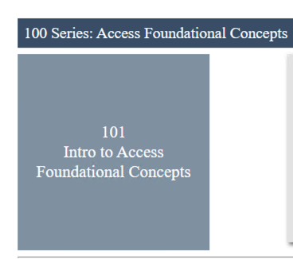

Lab 2: Access Profile  & Visual Policy Editor Overview
========================================================

Setup Lab Environment
-----------------------------------

To access your dedicated student lab environment, you will require a web browser and Remote Desktop Protocol (RDP) client software. The web browser will be used to access the Lab Training Portal. The RDP client will be used to connect to the Jump Host, where you will be able to access the BIG-IP management interfaces (HTTPS, SSH).

#. Click **DEPLOYMENT** located on the top left corner to display the environment

#. Click **ACCESS** next to jumpohost.f5lab.local

   |image001|

#. Select your RDP solution.  

#. The RDP client on your local host establishes a RDP connection to the Jump Host.

#. Login with the following credentials:

         - User: **f5lab\\user1**
         - Password: **user1**

#. After successful logon the Chrome browser will auto launch opening the site https://portal.f5lab.local.  This process usually takes 30 seconds after logon.

#. Click the **Classes** tab at the top of the page.

	|image002|

#. Scroll down the page until you see **101 Intro to Access Foundational Concepts** on the left

   |image003|

#. Hover over tile **Visual Policy Editor(VPE) Overview**. A start and stop icon should appear within the tile.  Click the **Play** Button to start the automation to build the environment

   |image004|

#. The screen should refresh displaying the progress of the automation within 30 seconds.  Scroll to the bottom of the automation workflow to ensure all requests succeeded.  If you you experience errors try running the automation a second time or open an issue on the `Access Labs Repo <https://github.com/f5devcentral/access-labs>`__.

   |image005|

Section 1 - The Access Profile
------------------------------

Section 2 - Visual Policy Editor(VPE)
----------------------------------------

Task 2.1 - Branches
~~~~~~~~~~~~~~~~~~~~~~~~~~~~

Task 2.2 - Building Blocks
~~~~~~~~~~~~~~~~~~~~~~~~~~~~

#. Logon
#. Authentication
#. Assignment
#. Endpoint Security (Server-Side)
#. Endpoint Security (Client-Side)
#. General Purpose

Task 2.3 - Macros
~~~~~~~~~~~~~~~~~~~

#. Why use macros?  And When?

#. Templates
    - AD auth and resources
    - AD auth and resources and password change
    - AD auth query and resources
    - AD query auth OTP by email and resources
    - AD auth query OTP by HTTP and resources
    - Support for Microsoft Exchange
    - AD auth and LocalDB lockout
    - LDAP auth and resources
    - LDAP auth query and resources
    - RADIUS and resources
    - SecurID and resources
    - Windows AntiVirus and Firewall
    - Client Classification and Prelogon checks
    - License Check and logging
    - BIG-IP as SAML Service Provider

Task 2.5: Endings
~~~~~~~~~~~~~~~~~~~

#. Edit Endings
    - Allow
    - Redirect
    - Deny
      - Customization
#. Endings in Macro vs Endings in Policy
#. Setting Default Endings

Lab CleanUp
------------------------

#. From a browser on the jumphost navigate to https://portal.f5lab.local

#. Click the **Classes** tab at the top of the page.

    |image002|

#. Scroll down the page until you see **101 Intro to Access Foundational Concepts** on the left

   |image003|

#. Hover over tile **Access Logs Overview**. A start and stop icon should appear within the tile.  Click the **Stop** Button to trigger the automation to remove any prebuilt objects from the environment

   |image998|

#. The screen should refresh displaying the progress of the automation within 30 seconds.  Scroll to the bottom of the automation workflow to ensure all requests succeeded.  If you you experience errors try running the automation a second time or open an issue on the `Access Labs Repo <https://github.com/f5devcentral/access-labs>`__.

   |image999|

#. This concludes the lab.

   |image000|

.. |image000| image:: ./media/lab02/000.png
.. |image001| image:: ./media/lab02/001.png
.. |image002| image:: ./media/lab02/002.png

.. |image004| image:: ./media/lab02/004.png

.. |image999| image:: ./media/lab02/999.png