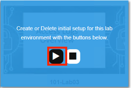
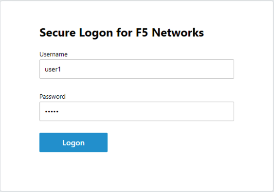
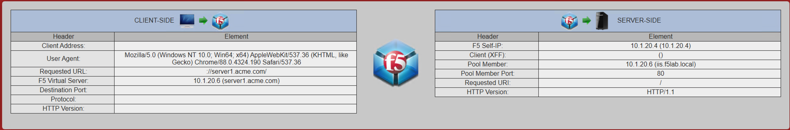
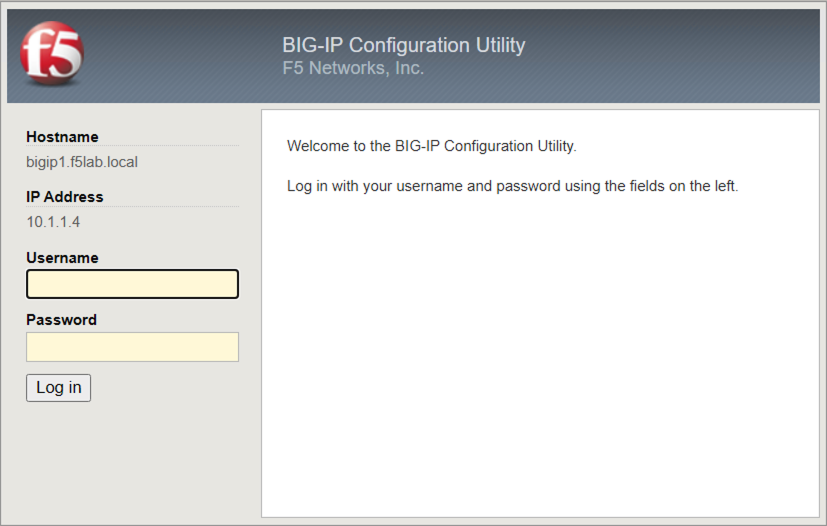
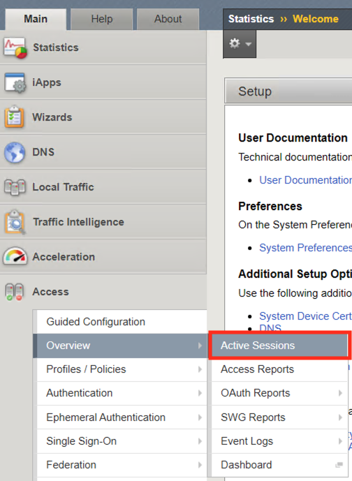
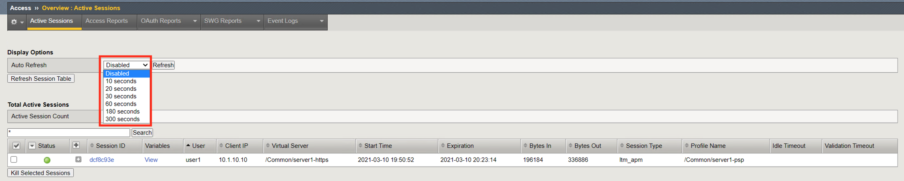
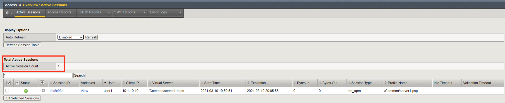
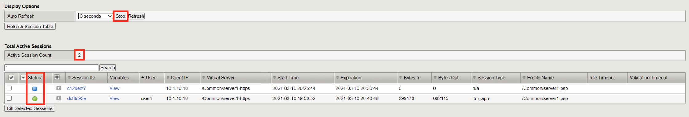
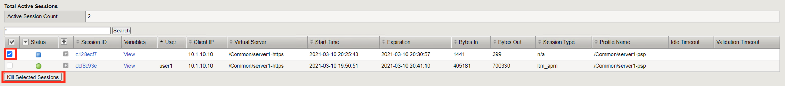
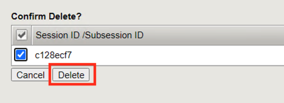

Lab 4: Access Logs Overview
=============================================

Access Policy Manager (APM) provides a default-log-setting. When you create an access profile, the default-log-setting is automatically assigned to it. The default-log-setting can be retained, removed, or replaced for the access profile. The default-log-setting is applied to user sessions only when it is assigned to an access profile.

Regardless of whether it is assigned to an access profile, the default-log-setting applies to APM processes that run outside of a user session. Specifically, on a BIG-IP system with an SWG subscription, the default-log-setting applies to URL database updates

Lab Requirements
----------------

A working configuration from Lab 1 or deploying the lab environment via Task 1: Setup Lab Enviroment below  

Task 1 - Setup Lab Environment
-----------------------------------

To access your dedicated student lab environment, you will require a web browser and Remote Desktop Protocol (RDP) client software. The web browser will be used to access the Lab Training Portal. The RDP client will be used to connect to the Jump Host, where you will be able to access the BIG-IP management interfaces (HTTPS, SSH).

#. Click **DEPLOYMENT** located on the top left corner to display the environment

#. Click **ACCESS** next to jumpohost.f5lab.local

   |image001|

#. Select your RDP solution.  

#. The RDP client on your local host establishes a RDP connection to the Jump Host.

#. Login with the following credentials:

         - User: **f5lab\\user1**
         - Password: **user1**

#. After successful logon the Chrome browser will auto launch opening the site https://portal.f5lab.local.  This process usually takes 30 seconds after logon.

	|image002|

#. Click the **Classes** tab at the top of the page.

#. Scroll down the page until you see **101 Intro to Access Foundational Concepts** on the left

   |image003|

#. Hover over tile **Access Logs Overview**. A start and stop icon should appear within the tile.  Click the **Play** Button to start the automation to build the environment

   |image004|

#. The screen should refresh displaying the progress of the automation within 30 seconds.  Scroll to the bottom of the automation workflow to ensure all requests succeeded.  If you you experience errors try running the automation a second time or open an issue on the `Access Labs Repo <https://github.com/f5devcentral/access-labs>`__.

   |image005|

Task 2 -  Active Sessions
---------------------------------------

#. Open a new tab in browser and then navigate to https://server1.acme.com.  You will be redirected to /my.policy and be presented a logon page.  

    |image006|

#. At the logon page enter the Username:**user1** and Password:**user1**
#. Click **Logon**
    
    |image007|

#.  You will be be presented the following website if the logon was successful.

    |image008|

#. Now that you have fully authenticated session open another tab and navigate to https://bigip1.f5lab.local

    |image009|

#. Login with username **admin** and password **admin**

    |image010|

#. Navigate to Access >> Overview >> Active Sessions.  

    |image011|

#. This **Active Sessions** page provides instance feedback on which users have successfully authenticated to APM along with their associated session information.  

    |image012|

#.  The Auto Refresh timer is disabled by default.  Various timers settings can be applied to auto update the Active session page.  Select 10 seconds is selected it will immediately begin counting down.  Alternativily the Refresh button and be clicked to immediatily update the table.

    |image013|

#. Active Session Count displays the number of completed and inactive sessions.  Notice the session count is currently **1**.

    |image014|

#. Open a new **ingognito** browser tab and navigate to https://server1.acme.com.  Do this will create a new session. Once presented a logon page, **DO NOT** logon and simply close the ingognito browser window.  

    |image015|

#. Return to the BIG-IP active session screen. If autorefresh is still enabled the next time it refreshes a new session will appear.  **Stop** the autorefresh.  

#. Notice the Active Session Count is now **2**

#. Notice the Status of the new session is a blue square rather than a green circle.  A green circle means The entire access policy has been completed from beginnning to end.  A blue circle means the session is not complete and is still in process.

    |image016|

#. **Check** the empty square next to the new session with a blue square.

#.  Click **Kill Selected Session**

    |image017|

#. A second screen will appear asking you to confirm you want to delete the session.  Click **Delete**

    |image018|

#. Only 1 Active Session should appear on the screen.

    |image019|

#. Search

Task 2: Access Reports
--------------------------------------

#. Report Parameters
#. Session ID
    - Log messages
#. View Session Variables
#. Build in Reports

Task 3: Log Settings
--------------------------------------------------

https://support.f5.com/csp/article/K24826763

#. General information
#. Access System Logs
#. URL Request Logs
#. Access Profiles
#. SSO Objects

Task 4: Dashboard
------------------

Task 5 - Lab CleanUp
------------------------

#. This concludes lab 4.

   |image000|

.. |image000| image:: ./media/lab04/000.png
.. |image001| image:: ./media/lab04/001.png
.. |image002| image:: ./media/lab04/002.png
.. |image003| image:: ./media/lab04/003.png

