Lab 3: Access Guided Configuration Concepts
=============================================

Objectives
----------

General overview of concepts and use cases for Access Guided Configuration.

Lab Requirements
----------------

Task 1: Updating Access Guided Configuration
---------------------------------------------

#. https://downloads.f5.com/esd/product.jsp?sw=BIG-IP&pro=Guided_Configuration

Task 2: Use Case Federation
--------------------------------------

#. API Authorization with OAuth
    When to use it
#. F5 as OAuth Client and Resource Server
    When to use it
#. OAuth Authorization Server
    When to use it
#. SAML Identity Provider for Applications
    When to use it
#. SAML Service Provider
    When to use it

Task 3: Zero Trust
-------------------

#. When to use it

Task 4: Microsoft Integration
-----------------------------

#. ADFS Proxy
    Advantages
#. Exchange Proxy
    Advantages

Task 5: API Protection
----------------------------

#. API Protection Proxy
    When to use it

Task 6: Credential Protection
------------------------------

#. Logon Protection
    When to use it

Lab 3 is now complete.

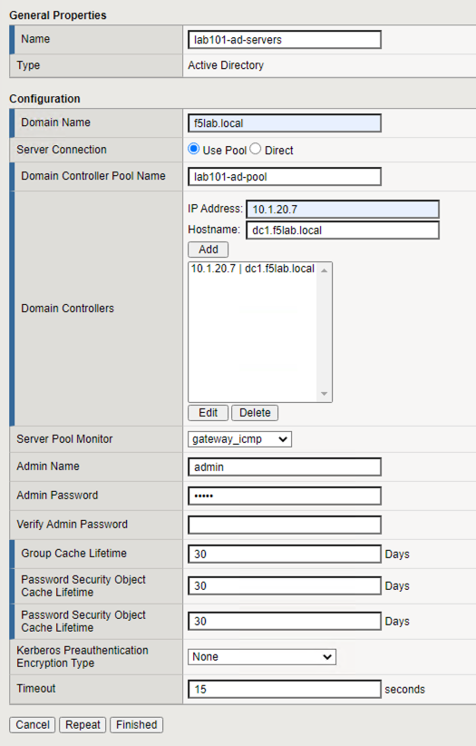
.. |image2| image:: media/002.png
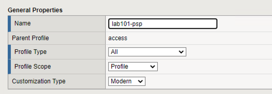
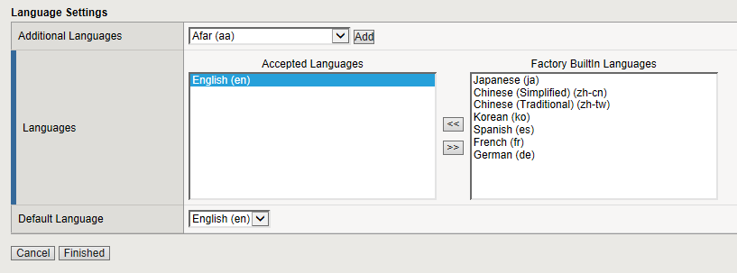
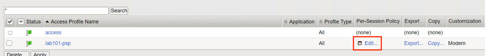
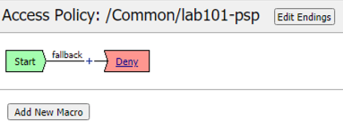
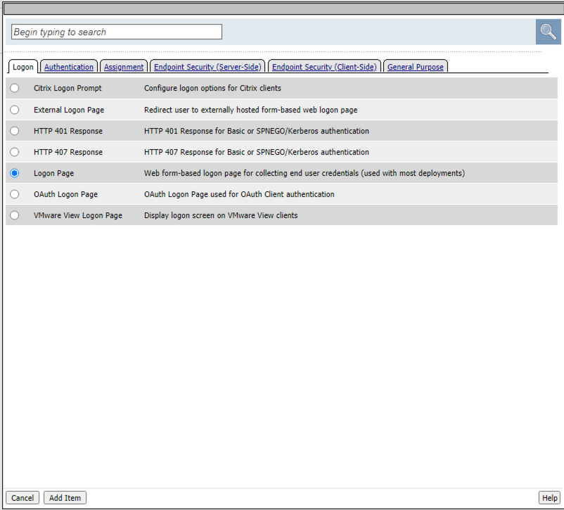
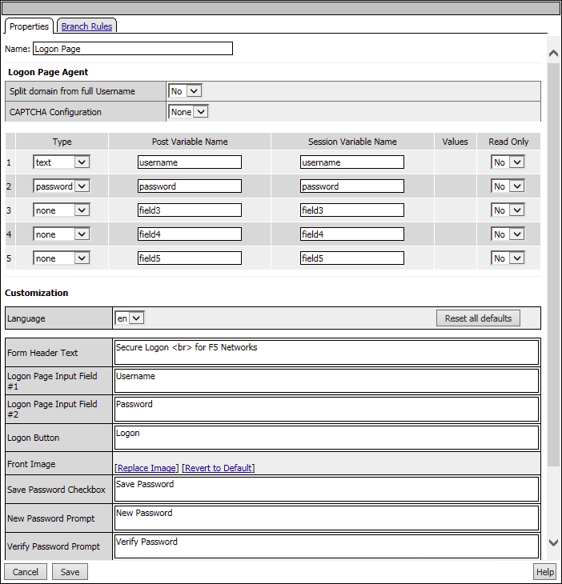
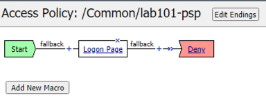
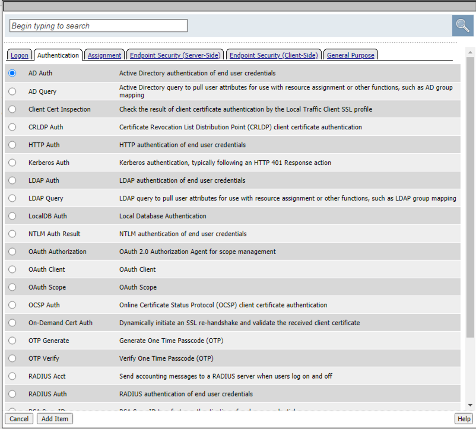
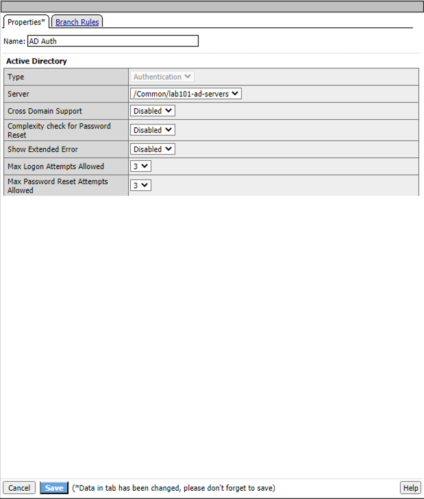
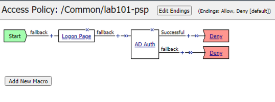
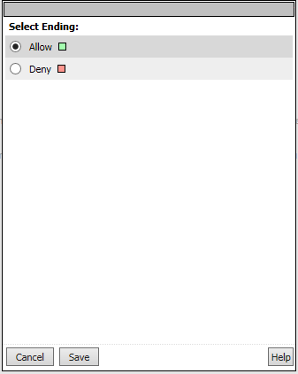
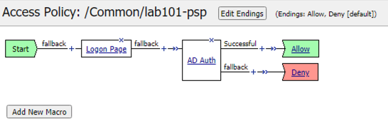
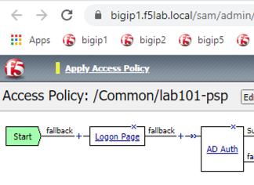
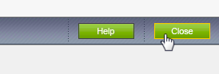
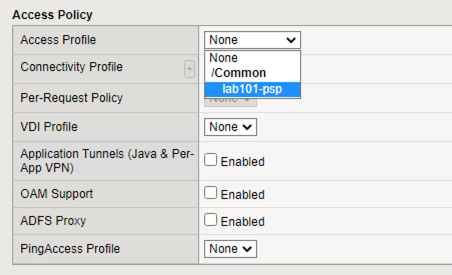
.. |image18| image:: media/018.png
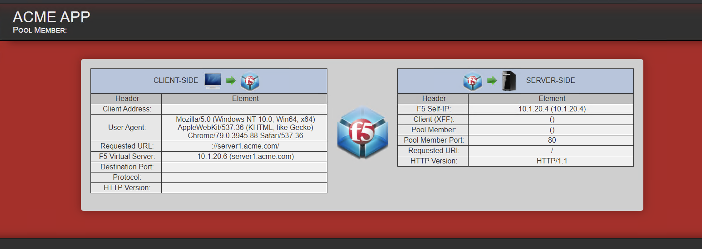
.. |image20| image:: media/020.png
.. |image21| image:: media/021.png
