Lab 2: Portal Resources
=========================

In this lab, we will add a Webtop resource to the Access Policy
created in the previous lab. A full webtop provides an access policy ending for an access policy branch to which you can optionally assign portal access resources, app tunnels, remote desktops, and webtop links, in addition to network access tunnels.
Then, the full webtop provides your clients with a web page on which they can choose resources, including a network access connection to start.

Section 1 - Setup Lab Environment
~~~~~~~~~~~~~~~~~~~~~~~~~~~~~~~~~~

Task 1 - Deploy prebuilt objects
-----------------------------------

To access your dedicated student lab environment, you will require a web browser and Remote Desktop Protocol (RDP) client software. The web browser will be used to access the Lab Training Portal. The RDP client will be used to connect to the Jump Host, where you will be able to access the BIG-IP management interfaces (HTTPS, SSH).

#. Click **DEPLOYMENT** located on the top left corner to display the environment

#. Click **ACCESS** next to jumpohost.f5lab.local

   |image001|

#. Select your RDP resolution.

#. The RDP client on your local host establishes a RDP connection to the Jump Host.

#. Login with the following credentials:

         - User: **f5lab\\user1**
         - Password: **user1**

#. After successful logon the Chrome browser will auto launch opening the site https://portal.f5lab.local.  This process usually takes 30 seconds after logon.

#. Click the **Classes** tab at the top of the page.

	|image002|

#. Scroll down the page until you see **102 Webtop Features** on the left

   |image003|

#. Hover over tile **Portal Resources**. A start and stop icon should appear within the tile.  Click the **Play** Button to start the automation to build the environment

   +---------------+-------------+
   | |image004|    | |image005|  |
   +---------------+-------------+

#. The screen should refresh displaying the progress of the automation within 30 seconds.  Scroll to the bottom of the automation workflow to ensure all requests succeeded.  If you experience errors try running the automation a second time or open an issue on the `Access Labs Repo <https://github.com/f5devcentral/access-labs>`__.

   |image006|

Section 2 - Basic Portal Resource
~~~~~~~~~~~~~~~~~~~~~~~~~~~~~~~~~~~~~

Task 1 - Create a portal resource
---------------------------------------

#. Expand the **Access** tab from the main menu on the left and navigate
   to **Webtops** > **Webtop Lists**.

#. Click **Create** to create a new Webtop called **MyFullWebtop**,
   select Type **Full** , uncheck  **Minimize To Tray** and
   click **Finished**.

Task 2 - Add a Webtop Resource to an existing Policy
------------------------------------------------------

#. Browse to **Access** > **Profiles / Policies > Access Profiles (Per-Session Policies)**, click on **Edit** for **MyAccessPolicy**. A new tab should open to the Visual Policy Editor for **MyAccessPolicy**.

   |Lab4-Image4|

#. In between the AD Auth APM Item and the Allow APM item click the + option to add an item.

   |Lab4-Image5|

#. Select the **Advanced Resource Assign** object. Click on the "Assignment Tab" and select the "Advanced Resource Assign" radio button. Click **Add Item**.

   |Lab4-Image6|

#. Then Click the "Add New Entry" button.

   |Lab4-Image7|

#. Then under the "Expression Section" click the "Add/Delete" button

#. Click on the **Webtop** tab, select the radio button for **MyFullWebtop**. Click on the **Webop Links** tab, and select the radio button for **F5Rocks** then click the **Update** button at the bottom of the screen.

   |Lab4-Image8|

#. Click **Save**.

#. At the top left of the browser window, click on **Apply Access Policy** , then close the tab. Replace the Access Profile on your app-https VIP with your myaccesspolicy Access profile and set the Per-Request Policy to None

   |Lab4-Image9|

#. Navigate to **Local Traffic** --> **Virtual Servers** --> **Virtual Server List**

    .. Note:: Make sure you are in the **Common Partition**

        |Lab4-Image17|

#. Open the **app-https** Virtual server, scroll down to the **Access Policy** section and ensure that **myaccesspolicy** has been assigned to this virtual server.

    |Lab4-Image18|

Task 3 - Test the Configuration
---------------------------------

#. Open a **New Incognito** web browser to the virtual server created in the previous lab by navigating to **https://app.acme.com**. You will be presented with a Logon page similar to the one from the last lab.

#. Enter the following credentials:

    +-------------+--------------+
    |Username:    |**user1**     |
    +-------------+--------------+
    |Password:    |**user1**     |
    +-------------+--------------+

#. Click **Logon**.

   This will open the APM Webtop landing page that shows the resources you are allowed to access. In this lab, we've only configured one resource:

   **F5 Rocks**, but you can add as many as you want and they will appear on this Webtop page.

   |Lab4-Image10|

Section 3 - Lab Cleanup
~~~~~~~~~~~~~~~~~~~~~~~~~~~~

Task 1 - Run Cleanup automation
---------------------------------

#. From a browser on the jumphost navigate to https://portal.f5lab.local

#. Click the **Classes** tab at the top of the page.

    |image002|

#. Scroll down the page until you see **06 Per-Session Access Control** on the left

   |image003|

#. Hover over tile **Cert Auth to Kerberos SSO**. A start and stop icon should appear within the tile.  Click the **Stop** Button to trigger the automation to remove any prebuilt objects from the environment

    +---------------+-------------+
    | |image004|    | |image007|  |
    +---------------+-------------+

#. The screen should refresh displaying the progress of the automation within 30 seconds.  Scroll to the bottom of the automation workflow to ensure all requests succeeded.  If you experience errors try running the automation a second time or open an issue on the `Access Labs Repo <https://github.com/f5devcentral/access-labs>`__.

   |image008|

#. This concludes the lab.

   |image000|

.. |image000| image:: ./media/lab01/000.png
.. |image001| image:: ./media/lab01/001.png
.. |image002| image:: ./media/lab01/002.png
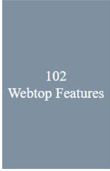
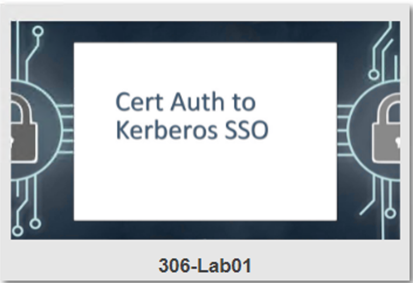
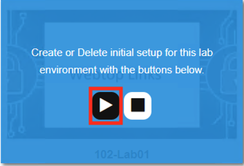
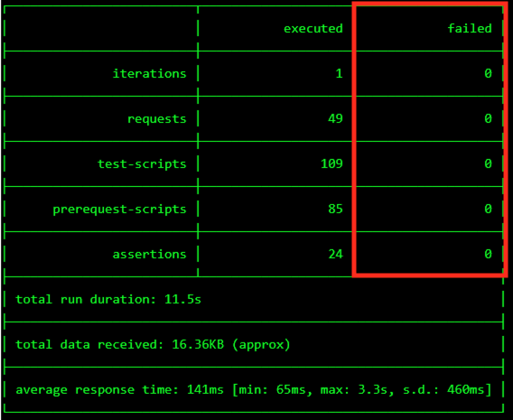
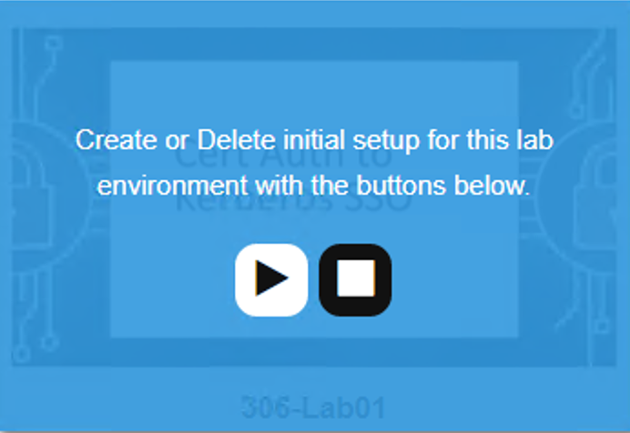
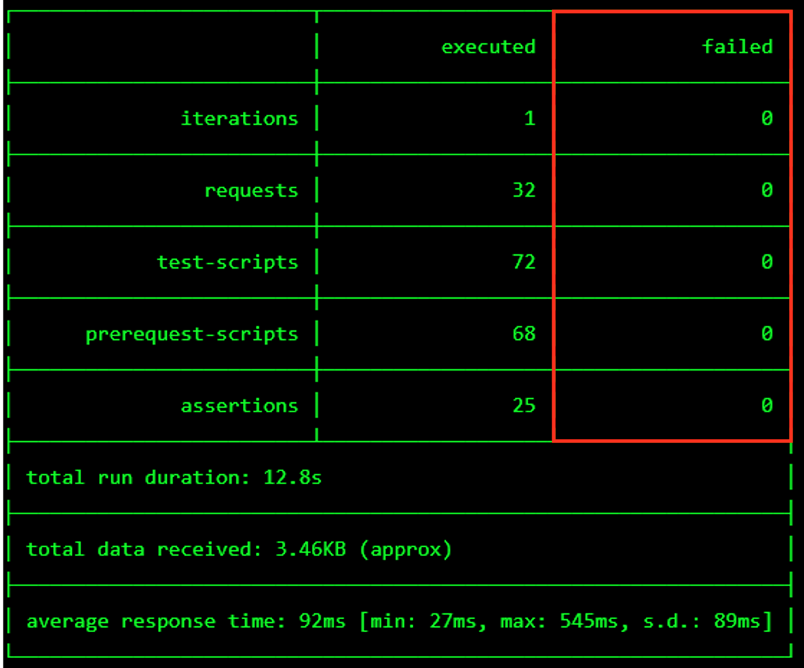
.. |image009| image:: ./media/lab01/009.png
.. |image010| image:: ./media/lab01/010.png
.. |image011| image:: ./media/lab01/011.png
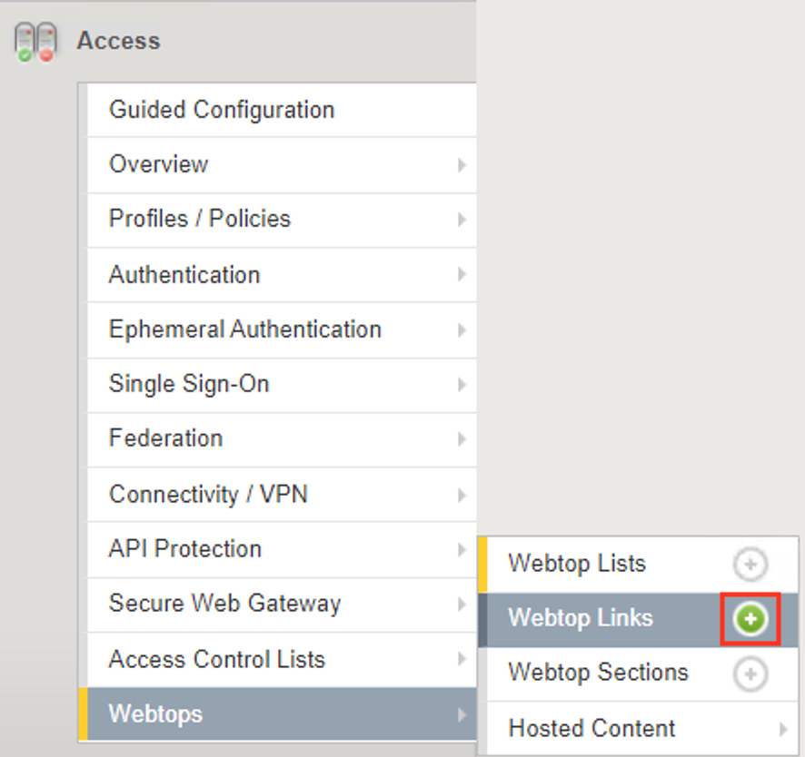
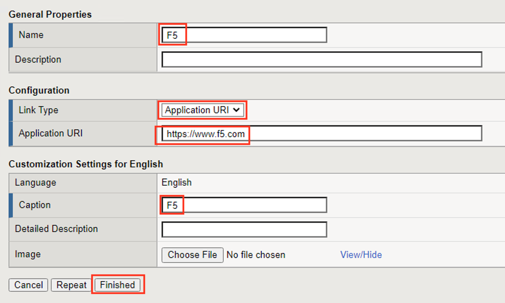
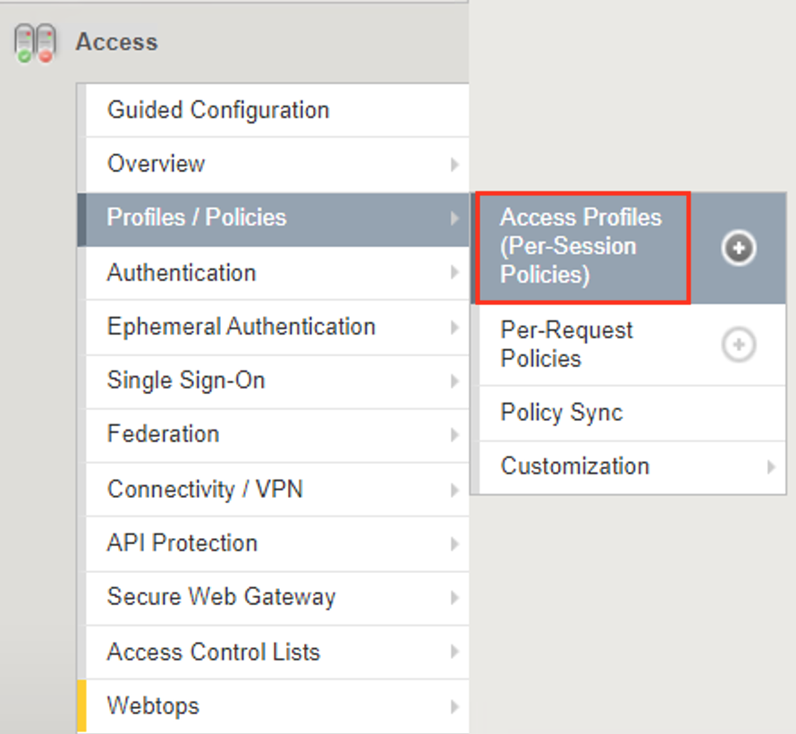
.. |image015| image:: ./media/lab01/015.png
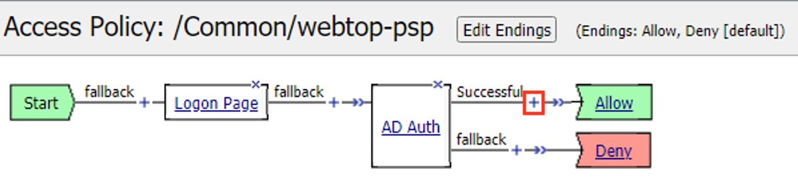
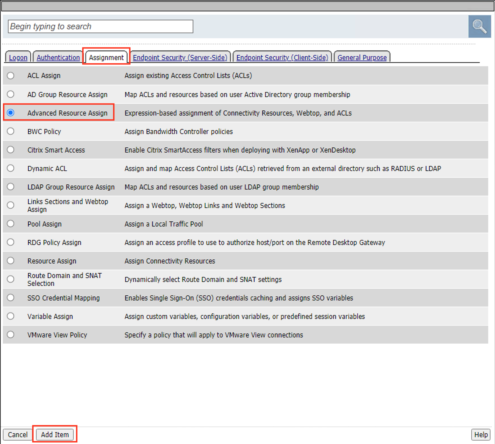
.. |image018| image:: ./media/lab01/018.png
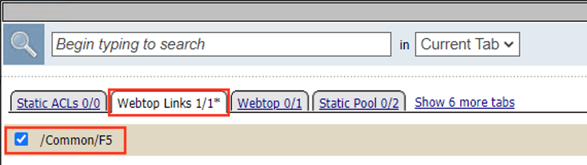
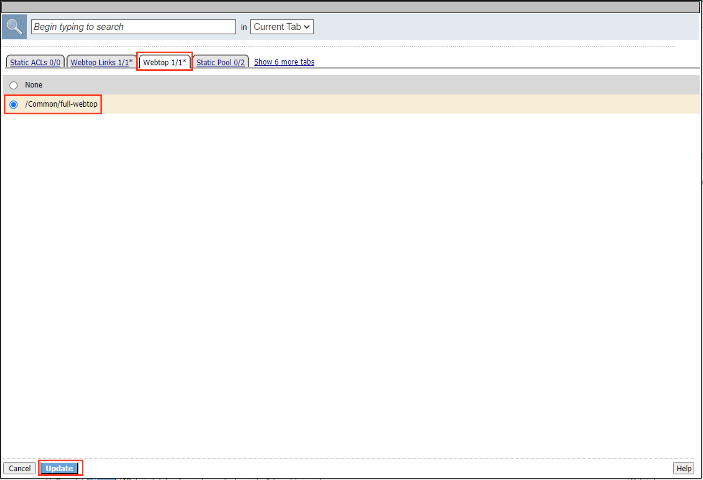
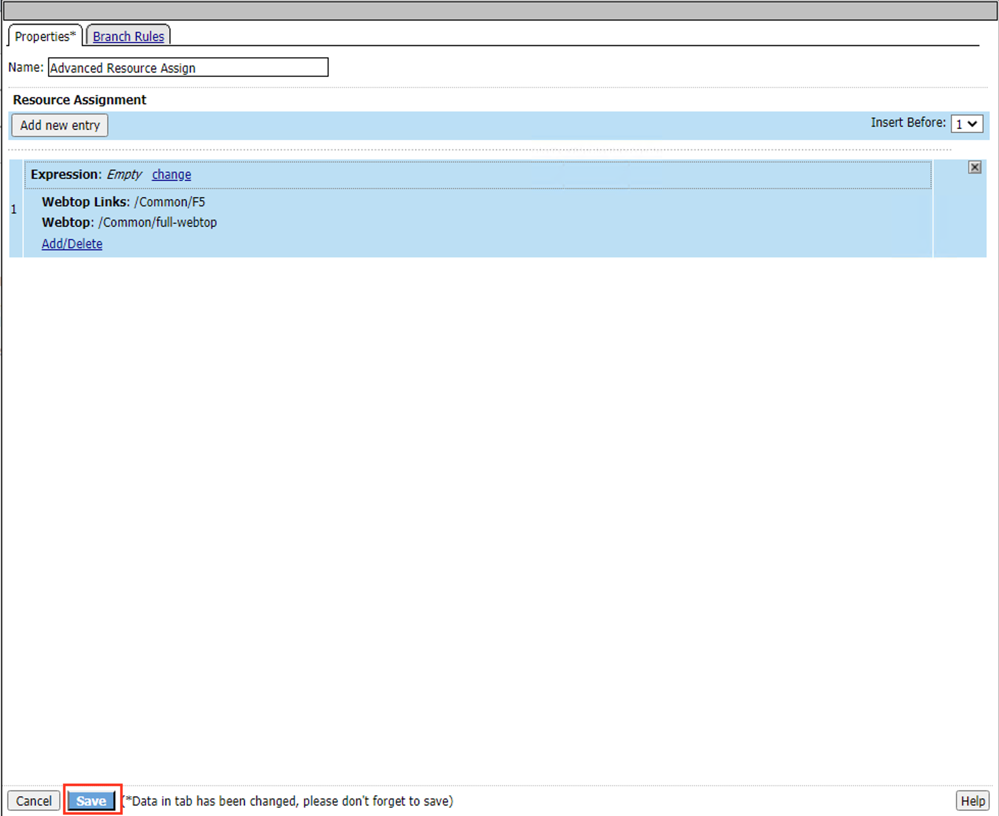
.. |image022| image:: ./media/lab01/022.png
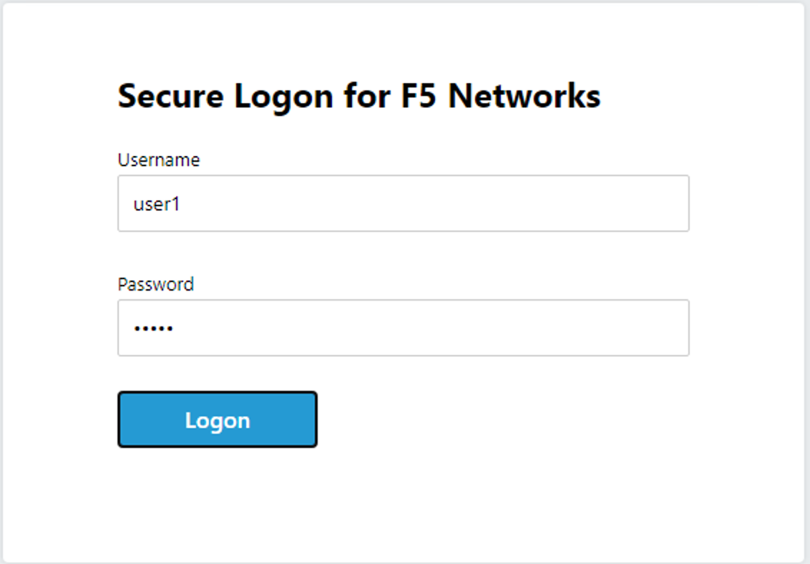
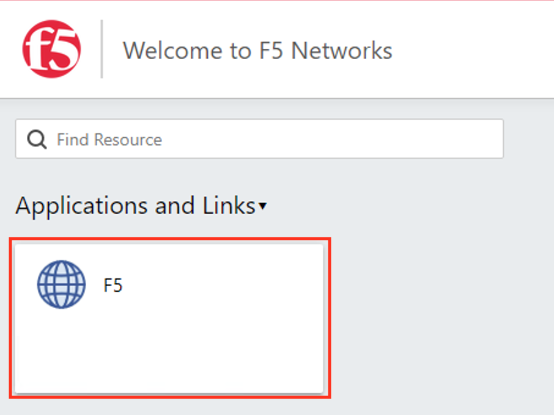
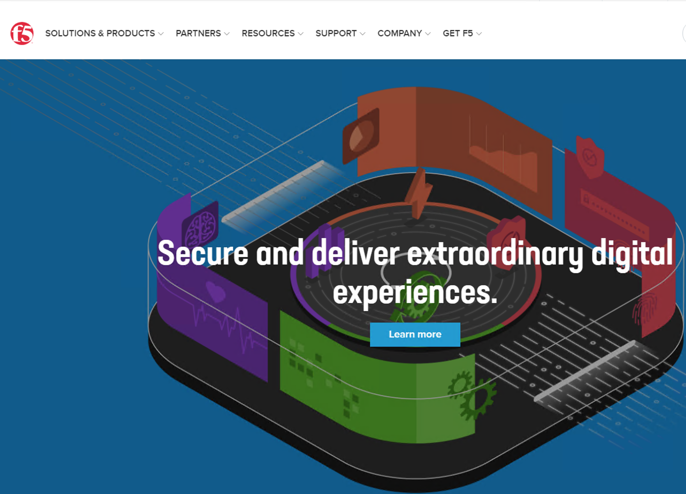
.. |image026| image:: ./media/lab01/026.png
.. |image027| image:: ./media/lab01/027.png
.. |image028| image:: ./media/lab01/028.png
.. |image029| image:: ./media/lab01/029.png
.. |image030| image:: ./media/lab01/030.png
.. |image031| image:: ./media/lab01/031.png
.. |image032| image:: ./media/lab01/032.png
.. |image033| image:: ./media/lab01/033.png
.. |image034| image:: ./media/lab01/034.png
.. |image035| image:: ./media/lab01/035.png
.. |image036| image:: ./media/lab01/036.png
.. |image037| image:: ./media/lab01/037.png
.. |image038| image:: ./media/lab01/038.png
.. |image039| image:: ./media/lab01/039.png
.. |image040| image:: ./media/lab01/040.png
.. |image041| image:: ./media/lab01/041.png
.. |image042| image:: ./media/lab01/042.png
.. |image043| image:: ./media/lab01/043.png
.. |image044| image:: ./media/lab01/044.png
.. |image045| image:: ./media/lab01/045.png
.. |image046| image:: ./media/lab01/046.png
.. |image047| image:: ./media/lab01/047.png
.. |image048| image:: ./media/lab01/048.png
.. |image049| image:: ./media/lab01/049.png
.. |image050| image:: ./media/lab01/050.png
.. |image051| image:: ./media/lab01/051.png
.. |image052| image:: ./media/lab01/052.png
.. |image053| image:: ./media/lab01/053.png
.. |image054| image:: ./media/lab01/054.png
.. |image055| image:: ./media/lab01/055.png
.. |image056| image:: ./media/lab01/056.png
.. |image057| image:: ./media/lab01/057.png
.. |image058| image:: ./media/lab01/058.png
.. |image059| image:: ./media/lab01/059.png
.. |image060| image:: ./media/lab01/060.png
.. |image061| image:: ./media/lab01/061.png
.. |image062| image:: ./media/lab01/062.png