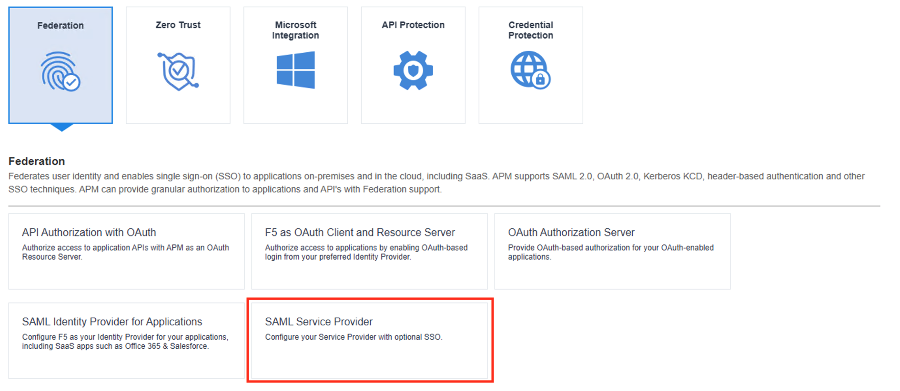
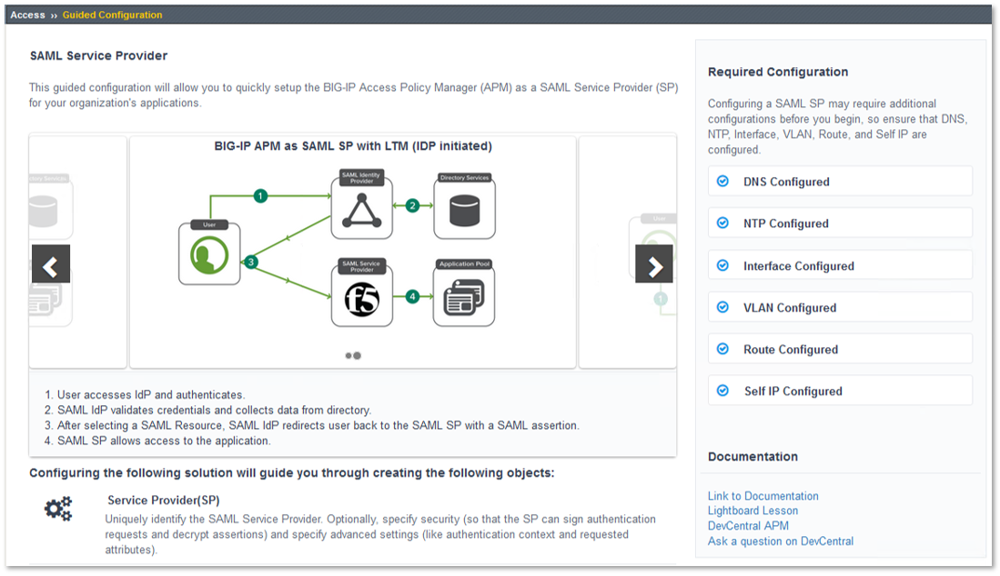
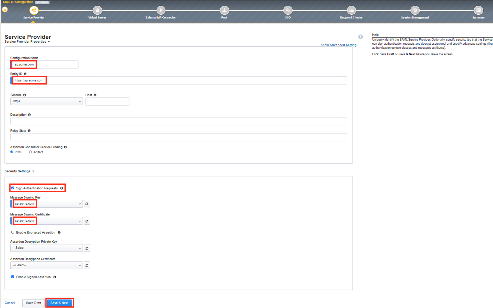
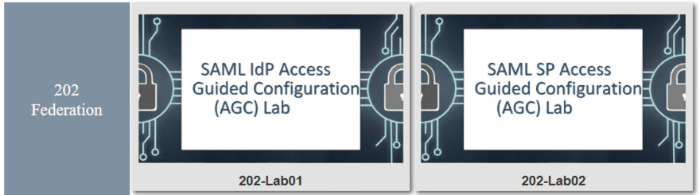

Lab 2: SAML SP Access Guided Configuration (AGC) Lab
=======================================================

The purpose of this lab is to configure and test SAML Federation Services.
This lab will be configured in two parts.  

Students will leverage Access Guided Configuration (AGC) to 
configure the various aspects of a SAML Service Provider (SP), import and bind to
a SAML Identity Provider (IdP) and test SP-Initiated SAML Federation.

Objective:
----------

-  Gain an understanding of SAML Federation configurations and
   their component parts through Access Guided Configuration (AGC)

-  Gain an understanding of the access flow for IDP & SP Initiated SAML

Lab Requirements:
-----------------

-  All Lab requirements will be noted in the tasks that follow

-  Estimated completion time: 25-30 minutes

Task 1 - Setup Lab environment
---------------------------------

To access your dedicated student lab environment, you will require a web browser and Remote Desktop Protocol (RDP) client software. The web browser will be used to access the Lab Training Portal. The RDP client will be used to connect to the Jump Host, where you will be able to access the BIG-IP management interfaces (HTTPS, SSH).

#. Click **DEPLOYMENT** located on the top left corner to display the environment

#. Click **ACCESS** next to jumphost.f5lab.local

   |image999|

#. Select your RDP solution.  

#. The RDP client on your local host establishes a RDP connection to the Jump Host.

#. Login with the following credentials:

         - User: **f5lab\\user1**
         - Password: **user1**

#. After successful logon the Chrome browser will auto launch opening the site https://portal.f5lab.local.  This process usually takes 30 seconds after logon.

#. Click the **Classes** tab at the top of the page.

	|image998|

#. Scroll down the page until you see **202 - Federation** on the left

   |image997|

#. Hover over tile **SAML IdP Access Guided Configuration(AGC) Lab**. A start and stop icon should appear within the tile.  Click the **Play** Button to start the automation to build the environment

   |image996|

#. The screen should refresh displaying the progress of the automation within 30 seconds.  Scroll to the bottom of the automation workflow to ensure all requests succeeded.  If you you experience errors try running the automation a second time or open an issue on the `Access Labs Repo <https://github.com/f5devcentral/access-labs>`__.

   |image995|

                                                                         |

TASK 2: Configure a SAML Service Provider (SP) via AGC 
-------------------------------------------------------------

+----------------------------------------------------------------------------------------------+
| 1. Navigate to **Access -> Guided Configuration** in the left-hand menu.                     |
|                                                                                              |
| 2. Once **Guided Configuration** loads, click on **Federation**.                             |
+----------------------------------------------------------------------------------------------+
| |image001|                                                                                   |
+----------------------------------------------------------------------------------------------+

+----------------------------------------------------------------------------------------------+
| 3. In the resulting **Federation** sub-menu click, **SAML Service Provider**.                |
+----------------------------------------------------------------------------------------------+
| |image002|                                                                                   |
+----------------------------------------------------------------------------------------------+

+----------------------------------------------------------------------------------------------+
| 4. In the resulting **SAML Service Provider** window, review the **{SP-Initiated)** flow     |
|                                                                                              |
|    and then click the **right arrow**.                                                       |
+----------------------------------------------------------------------------------------------+
| |image003|                                                                                   |
+----------------------------------------------------------------------------------------------+

+----------------------------------------------------------------------------------------------+
| 5. Review the **IdP-Initiated** flow and then scroll down to the bottom of the window.       |
+----------------------------------------------------------------------------------------------+
| |image004|                                                                                   |
+----------------------------------------------------------------------------------------------+

+----------------------------------------------------------------------------------------------+
| 6. Review the configuration objects to be created and the click **Next**.                    |
+----------------------------------------------------------------------------------------------+
| |image005|                                                                                   |
+----------------------------------------------------------------------------------------------+

TASK 3: Configure the Service Provider
-------------------------------------------------------------

+----------------------------------------------------------------------------------------------+
| 1. In the **Service Provider Properties** section, enter the following values in the fields  |
|                                                                                              |
|    provided:                                                                                 |
|                                                                                              |
|    * In the **Configuration Name** field input **sp.acme.com**.                              |
|                                                                                              |
|    * In the **Entity ID** field input **https://sp.acme.com**.                               |
|                                                                                              |
| 2. In the **Security Settings** section, check the checkbox next to **Sign Authentication**  |
|                                                                                              |
|    **Requests**.                                                                             |
|                                                                                              |
| 3. In the updated **Security Settings** section, use the dropdowns to select the following:  |
|                                                                                              |
|    * For the **Message Signing Key** select **sp.acme.com**.                                 |
|                                                                                              |
|    * For the **Message Signing Certificate** select **sp.acme.com**.                         |
|                                                                                              |
| 4. Click **Save & Next**.                                                                    |
+----------------------------------------------------------------------------------------------+
| |image006|                                                                                   |
+----------------------------------------------------------------------------------------------+

TASK 3: Configure the Virtual Server
-------------------------------------------------------------

+----------------------------------------------------------------------------------------------+
| 1. In the **Virtual Server Properties** section, enter the following values in the fields    |
|                                                                                              |
|    provided:                                                                                 |
|                                                                                              |
|    * In the **Destination Address** field input **10.1.10.103**.                             |
|                                                                                              |
|    * In the **Service Port** field input **443** **HTTPS**                                   |
|                                                                                              |
|    * In the **Redirect Port** field input **80** **HTTP**                                    |
|                                                                                              |
| 2. In the **Client SSL Profile** section, use the arrows to move only the                    |
|                                                                                              |
|    **acme.com-wildcard** profile to the right-hand column as shown.                          |
|                                                                                              |
| 3. Click **Save & Next**.                                                                    |
+----------------------------------------------------------------------------------------------+
| |image007|                                                                                   |
+----------------------------------------------------------------------------------------------+

TASK 4: Configure External IdP Connector
-------------------------------------------------------------

+----------------------------------------------------------------------------------------------+
| 1. In the **External Identity Provider Connector Settings** section, use the first dropdown  |
|                                                                                              |
|    **Select Method to configure your IdP Connector** to select **Metadata**.                 |
|                                                                                              |
| 2. In the updated window, click the **Choose File** button and then browse the **Jumphost**  |
|                                                                                              |
|    desktop and select the file **idp_partner_com_metadata.xml**.                             |
|                                                                                              |
| 3. In the **Name** field, input **idp.partner.com**                                          |
|                                                                                              |
| 4. Click **Save & Next**.                                                                    |
+----------------------------------------------------------------------------------------------+
| |image033|                                                                                   |
+----------------------------------------------------------------------------------------------+

TASK 5: Configure Pool
-------------------------------------------------------------

+----------------------------------------------------------------------------------------------+
| 1. Click **Show Advanced Setting** in the upper right of the **Guided Configuration**.       |
|                                                                                              |
| 2. In the **Pool Properties** section, use the dropdown to select **Create New** for         |
|                                                                                              |
|    **Select a Pool**.                                                                        |
|                                                                                              |
| 3. In the **Health Monitors** section, use the arrows to move only the **/Common/http**      |
|                                                                                              |
|    health monitor to the right-hand column as shown.                                         |
|                                                                                              |
| 4. In the **Resource Properties** section, use the dropdown to select **Least Connections**  |
|                                                                                              |
|    **(member)** for **Load Balancing Method**.                                               |
|                                                                                              |
| 5. For the **Pool Servers** section, use the first dropdown for **IP Address/Node Name** to  |
|                                                                                              |
|    select **/Common/10.1.20.6**. Ensure port **80** and **HTTP** are set for the **Port**.   |
|                                                                                              |
| 6. Click **Save & Next**.                                                                    |
+----------------------------------------------------------------------------------------------+
| |image034|                                                                                   |
+----------------------------------------------------------------------------------------------+

TASK 6: Configure SSO
-------------------------------------------------------------

+----------------------------------------------------------------------------------------------+
| 1. In the **Single Sign-On Settings** section, check the **Enable Signle Sign-On** checkbox. |
|                                                                                              |
| 2. Use the **Selected Single Sign-On Type** dropdown to select **HTTP header-based**.        |
|                                                                                              |
| 3. In the **Username Source** field, ensure **session.saml.last.identity** is present.       |
|                                                                                              |
| 4. In the **SSO Headers** section, makes sure the following values are correct:              |
|                                                                                              |
|    * **Header Operation: replace**                                                           |
|                                                                                              |
|    * **Header Name: Authorization**                                                          |
|                                                                                              |
|    * **Header Value: %{session.saml.last.identity}**                                         |
|                                                                                              |
| 5. Scroll to the bottom of the window and Click **Save & Next**.                             |
+----------------------------------------------------------------------------------------------+
| |image035|                                                                                   |
+----------------------------------------------------------------------------------------------+

TASK 7: Configure Endpoint Checks
-------------------------------------------------------------

+----------------------------------------------------------------------------------------------+
| 1. In the **Endpoints Checks Properties** window, click **Save & Next**.                     |
|                                                                                              |
| **Note:** *Endpoints checks can also be configured to protect application access.  The*      |
|                                                                                              |
| *Access 302 Lab, hosted at this year's Agility will have additional details.*                |
+----------------------------------------------------------------------------------------------+
| |image036|                                                                                   |
+----------------------------------------------------------------------------------------------+

TASK 8: Configure Session Management
-------------------------------------------------------------

+----------------------------------------------------------------------------------------------+
| 1. Review the Session Managment settings, in the **Timeout Settings** section then scroll to |
|                                                                                              |
|    the bottom of the window and click **Save & Next**.                                       |
+----------------------------------------------------------------------------------------------+
| |image037|                                                                                   |
+----------------------------------------------------------------------------------------------+

TASK 9: Review the Summary and Deploy
-------------------------------------------------------------

+----------------------------------------------------------------------------------------------+
| 1. Review the Summary, then scroll to the bottom of the window and click **Deploy**.         |
+----------------------------------------------------------------------------------------------+
| |image038|                                                                                   |
+----------------------------------------------------------------------------------------------+

+----------------------------------------------------------------------------------------------+
| 2. The application is now deployed click **Finish**.                                         |
+----------------------------------------------------------------------------------------------+
| |image039|                                                                                   |
+----------------------------------------------------------------------------------------------+

+----------------------------------------------------------------------------------------------+
| 3. Review the Access Guided Confguration window, **Status** for **agc-sp.acme.com** is       |
|                                                                                              |
|    **DEPLOYED**.                                                                             |
+----------------------------------------------------------------------------------------------+
| |image040|                                                                                   |
+----------------------------------------------------------------------------------------------+

TASK: 10: Testing the SAML Service Provider (SP)
-------------------------------------------------------------

+----------------------------------------------------------------------------------------------+
| 1. Open Firefox from the Jumphost desktop and click on the **AGC-SP (Partner)** link in the  |
|                                                                                              |
|    bookmark toolbar.                                                                         |
|                                                                                              |
| **Note:** *If you have issues, open Firefox in a New Private Window (Incognito/Safe Mode)*   |
+----------------------------------------------------------------------------------------------+
| |image041|                                                                                   |
+----------------------------------------------------------------------------------------------+

+----------------------------------------------------------------------------------------------+
| 2. Once the page loads, enter **user1** for username and **user1** for password  in the      |
|                                                                                              |
|    **Partner Secure Logon** form and click the **Logon** button.                             |
+----------------------------------------------------------------------------------------------+
| |image042|                                                                                   |
+----------------------------------------------------------------------------------------------+

+----------------------------------------------------------------------------------------------+
| 3. The **Partner Application** will now open if successfully configured.                     |
+----------------------------------------------------------------------------------------------+
| |image043|                                                                                   |
+----------------------------------------------------------------------------------------------+

TASK 11: End of Lab1
-------------------------------------------------------------

+----------------------------------------------------------------------------------------------+
| 1. This concludes Part 2 of Lab1. This concludes Lab1, feel free to review and test the      |
|                                                                                              |
|    configuration.                                                                            |
+----------------------------------------------------------------------------------------------+
| |image000|                                                                                   |
+----------------------------------------------------------------------------------------------+

.. |image001| image:: ./media/lab02/001.png
   :width: 800px

.. |image003| image:: ./media/lab02/003.png
   :width: 800px

.. |image005| image:: ./media/lab02/005.png
   :width: 800px

.. |image995| image:: ./media/lab02/995.png
   :width: 800px
.. |image996| image:: ./media/lab02/996.png
   :width: 800px

.. |image998| image:: ./media/lab02/998.png
   :width: 800px 
.. |image999| image:: ./media/lab02/999.png
   :width: 800px

