Lab 2: SAML Identity Provider (IdP) Lab
=======================================

The purpose of this lab is to configure and test a SAML Identity Provider.
Students will configure the various aspect of a SAML Identity Provider, import
and bind to a SAML Service Provider and test IdP-Initiated SAML Federation.

Objective:

-  Gain an understanding of SAML Identity Provider(IdP) configurations and
   its component parts

-  Gain an understanding of the access flow for IdP-Initiated SAML

Lab Requirements:

-  All Lab requirements will be noted in the tasks that follow

Estimated completion time: 25 minutes

Setup Lab Environment
-----------------------------------

To access your dedicated student lab environment, you will require a web browser and Remote Desktop Protocol (RDP) client software. The web browser will be used to access the Lab Training Portal. The RDP client will be used to connect to the Jump Host, where you will be able to access the BIG-IP management interfaces (HTTPS, SSH).

#. Click **DEPLOYMENT** located on the top left corner to display the environment

#. Click **ACCESS** next to jumpohost.f5lab.local

   |image001|

#. Select your RDP resolution.

#. The RDP client on your local host establishes a RDP connection to the Jump Host.

#. Login with the following credentials:

         - User: **f5lab\\user1**
         - Password: **user1**

#. After successful logon the Chrome browser will auto launch opening the site https://portal.f5lab.local.  This process usually takes 30 seconds after logon.

#. Click the **Classes** tab at the top of the page.

	|image002|

#. Scroll down the page until you see **301 SAML Federation** on the left

   |image003|

#. Hover over tile **SAML Identity Provider (IdP)**. A start and stop icon should appear within the tile.  Click the **Play** Button to start the automation to build the environment

   |image004|

#. The screen should refresh displaying the progress of the automation within 30 seconds.  Scroll to the bottom of the automation workflow to ensure all requests succeeded.  If you experience errors try running the automation a second time or open an issue on the `Access Labs Repo <https://github.com/f5devcentral/access-labs>`__.

   |image005|

TASK 1 ‑ Configure the SAML Identity Provider (IdP)
--------------------------------------------------------

IdP Service
~~~~~~~~~~~~~~~~

#. Begin by selecting: **Access ‑> Federation ‑> SAML Identity Provider
   ‑> Local IdP Services**

#. Click the **Create** button (far right)

   |image006|

#. In the **Create New SAML IdP Service** dialog box, click **General Settngs**
   in the left navigation pane and key in the following:

   +-------------------+--------------------------------+
   | IdP Service Name: | ``idp.acme.com``               |
   +-------------------+--------------------------------+
   | IdP Entity ID:    | ``https://idp.acme.com``       |
   +-------------------+--------------------------------+

   |image007|

   .. NOTE:: The yellow box on "Host" will disappear when the Entity ID is
      entered

#. In the **Create New SAML IdP Service** dialog box, click **Assertion
   Settings** in the left navigation pane and key in the following:

   +--------------------------+------------------------------------------------+
   | Assertion Subject Type:  | ``Persistent Identifier`` (drop down)          |
   +--------------------------+------------------------------------------------+
   | Assertion Subject Value: | ``%{session.logon.last.username}`` (drop down) |
   +--------------------------+------------------------------------------------+

   |image008|

#. In the **Create New SAML IdP Service** dialog box, click
   **SAML Attributes** in the left navigation pane and click the
   **Add** button as shown

    |image009|

#. In the **Name** field in the resulting pop-up window, enter the
   following: ``emailaddress``

#. Under **Attribute Values**, click the **Add** button

#. In the **Values** line, enter the following: ``%{session.ad.last.attr.mail}``

#. Click the **Update** button

#. Click the **OK** button

   |image010|

#. In the **Create New SAML IdP Service** dialog box, click
   **Security Settings** in the left navigation pane and key in
   the following:

   +----------------------+---------------------------------------+
   | Signing Key:         | ``/Common/idp.acme.com`` (drop down)  |
   +----------------------+---------------------------------------+
   | Signing Certificate: | ``/Common/idp.acme.com`` (drop down)  |
   +----------------------+---------------------------------------+

   .. NOTE:: The certificate and key were previously imported

#. Click **OK** to complete the creation of the IdP service

   |image011|

SP Connector
~~~~~~~~~~~~~~~~~

#. Click on **External SP Connectors** (under the **SAML Identity Provider**
   tab) in the horizontal navigation menu

#. Click specifically on the **Down Arrow** next to the **Create** button
   (far right)

#. Select **From Metadata** from the drop down menu

   |image012|

#. In the **Create New SAML Service Provider** dialogue box, click **Browse**
   and select the *sp_acme_com.xml* file from the Desktop of
   your jump host

#. In the **Service Provider Name** field, enter the following:
   ``sp.acme.com``

#. Click **OK** on the dialog box

   |image013|

   .. NOTE:: The sp_acme_com.xml file was created previously.
      Oftentimes SP providers will have a metadata file representing their
      SP service. This can be imported to save object creation time as has
      been done in this lab.

#. Click on **Local IdP Services** (under the **SAML Identity Provider** tab)
   in the horizontal navigation menu

   |image014|

#. Select the **Checkbox** next to the previously created ``idp.acme.com``
   and click the **Bind/Unbind SP Connectors** button at the bottom of the GUI

   |image015|

#. In the **Edit SAML SP's that use this IdP** dialog, select the
   ``/Common/sp.acme.com`` SAML SP Connection Name created previously

#. Click the **OK** button at the bottom of the dialog box

   |image016|

#. Under the **Access ‑> Federation ‑> SAML Identity Provider ‑>
   Local IdP Services** menu you should now see the following (as shown):

   +---------------------+------------------------+
   | Name:               | ``idp.acme.com``       |
   +---------------------+------------------------+
   | SAML SP Connectors: | ``sp.acme.com``        |
   +---------------------+------------------------+

   |image017|

TASK 2 - Create a SAML Resource
-------------------------------------

#. Begin by selecting **Access ‑> Federation ‑> SAML Resources**

#. Click the **Create** button (far right)

#. In the **New SAML Resource** window, enter the following values:

   +--------------------+------------------------+
   | Name:              | ``sp.acme.com``        |
   +--------------------+------------------------+
   | SSO Configuration: | ``idp.acmem.com``      |
   +--------------------+------------------------+
   | Caption:           | ``sp.acme.com``        |
   +--------------------+------------------------+

#. Click **Finished** at the bottom of the configuration window

   |image37|

   |br|

   |image38|

Task 3 - Create a Webtop
-------------------------------

#. Select **Access ‑> Webtops ‑> Webtop List**

#. Click the **Create** button (far right)

   |image39|

#. In the resulting window, enter the following values:

   +-------+----------------------+
   | Name: | ``full_webtop``      |
   +-------+----------------------+
   | Type: | ``Full`` (drop down) |
   +-------+----------------------+

#. Click **Finished** at the bottom of the GUI

   |image40|

Task 4 - Create a SAML IdP Access Policy
---------------------------------------------

#. Select **Access ‑> Profiles/Policies ‑> Access Profiles
   (Per-Session Policies)**

#. Click the **Create** button (far right)

   |image41|

#. In the **New Profile** window, enter the following information:

   +----------------+---------------------------+
   | Name:          | ``idp.acme.com‑psp``      |
   +----------------+---------------------------+
   | Profile Type:  | ``All`` (drop down)       |
   +----------------+---------------------------+
   | Profile Scope: | ``Profile`` (default)     |
   +----------------+---------------------------+

#. Scroll to the bottom of the **New Profile** window to the
   **Language Settings** section

#. Select *English* from the **Factory Built‑in Languages** menu on the
   right and click the **Double Arrow (<<)**, then click the **Finished**
   button.

#. The **Default Language** should be automatically set

   |image42|

#. From the **Access ‑> Profiles/Policies ‑> Access Profiles
   (Per-Session Policies) screen**, click the **Edit** link on the previously
   created ``idp.acme.com-psp`` line

   |image43|

#. Click the **Plus (+) Sign** between **Start** and **Deny**

   |image44|

#. In the pop-up dialog box, select the **Logon** tab and then select the
   **Radio** next to **Logon Page**, and click the **Add Item** button

#. Click **Save** in the resulting Logon Page dialog box

   |image45|

#. Click the **Plus (+) Sign** between **Logon Page** and **Deny**

   |image46|

#. In the pop-up dialog box, select the **Authentication** tab and then
   select the **Radio** next to **AD Auth**, and click the **Add Item** button

   |image47|

#. In the resulting **AD Auth** pop-up window, select ``/Common/f5lab.local``
   from the **Server** drop down menu

#. Click **Save** at the bottom of the window

   |image48|

#. Click the **Plus (+) Sign** on the successful branch between **AD Auth**
   and **Deny**

   |image49|

#. In the pop-up dialog box, select the **Authentication** tab and then
   select the **Radio** next to **AD Query**, and click the **Add Item** button

   |image50|

#. In the resulting **AD Query** pop-up window, select ``/Common/f5lab.local``
   from the **Server** drop down menu

   |image51|

#. In the **AD Query** pop‑up window, select the **Branch Rules** tab

#. Change the **Name** of the branch to *Successful*.

#. Click the **Change** link next to the **Expression**

   |image52|

#. In the resulting pop-up window, delete the existing expression by
   clicking the **X** as shown

   |image53|

#. Create a new **Simple** expression by clicking the **Add Expression** button

   |image54|

#. In the resulting menu, select the following from the drop down menus:

   +------------+---------------------+
   | Agent Sel: | ``AD Query``        |
   +------------+---------------------+
   | Condition: | ``AD Query Passed`` |
   +------------+---------------------+

#. Click the **Add Expression** Button

   |image55|

#. Click the **Finished** button to complete the expression

   |image56|

   |br|

   |image57|

#. Click the **Save** button to complete the **AD Query**

#. Click the **Plus (+) Sign** on the successful branch between **AD Query** and **Deny**

   |image58|

#. In the pop-up dialog box, select the **Assignment** tab and then select
   the **Radio** next to **Advanced Resource Assign**, and click the
   **Add Item** button

   |image59|

#. In the resulting **Advanced Resource Assign** pop-up window, click the
   **Add New Entry** button

#. In the new Resource Assignment entry, click the **Add/Delete** link

   |image60|

#. In the resulting pop-up window, click the **SAML** tab, and select the
   **Checkbox** next to ``/Common/sp.acme.com``

   |image61|

#. Click the **Webtop** tab, and select the **Checkbox** next to
   ``/Common/full_webtop``

   |image62|

#. Click the **Update** button at the bottom of the window to complete
   the Resource Assignment entry

#. Click the **Save** button at the bottom of the
   **Advanced Resource Assign** window

#. In the **Visual Policy Editor**, select the **Deny** ending on the
   fallback branch following **Advanced Resource Assign**

   |image63|

#. In the **Select Ending** dialog box, selet the **Allow** radio button
   and then click **Save**

   |image64|

#. In the **Visual Policy Editor**, click **Apply Access Policy** (top left),
   and close the **Visual Policy Editor**

   |image65|

TASK 6 - Create the IdP Virtual Server
----------------------------------------

#. Begin by selecting **Local Traffic ‑> Virtual Servers**

#. Click the **Create** button (far right)

   |image66|

#. In the **New Virtual Server** window, enter the following information:

   +---------------------------+------------------------------+
   | General Properties                                       |
   +===========================+==============================+
   | Name:                     | ``idp.acme.com``             |
   +---------------------------+------------------------------+
   | Destination Address/Mask: | ``10.1.10.102``              |
   +---------------------------+------------------------------+
   | Service Port:             | ``443``                      |
   +---------------------------+------------------------------+

   +---------------------------+------------------------------+
   | Configuration                                            |
   +===========================+==============================+
   | HTTP Profile:             | ``http`` (drop down)         |
   +---------------------------+------------------------------+
   | SSL Profile (Client)      | ``wildcard.acme.com``        |
   +---------------------------+------------------------------+

   +-----------------+---------------------------+
   | Access Policy                               |
   +=================+===========================+
   | Access Profile: | ``idp.acme.com-psp``      |
   +-----------------+---------------------------+

   |image67|

   |br|

   |image68|

#. Scroll to the bottom of the configuration window and click **Finished**

TASK 7 - Test the SAML IdP
-------------------------------

#. Using your browser from the jump host, navigate to the SAML IdP you just
   configured at ``https://idp.acme.com`` (or click the provided bookmark)

   |image69|

#. Log in to the IdP.   Were you successfully authenticated? Did you see the
   webtop with the SP application?

 

#. Click on the Partner App icon. Were you successfully authenticated
   (via SAML) to the SP?

#. Review your Active Sessions **(Access ‑> Overview ‑> Active Sessions­­­)**

#. Review your Access Report Logs **(Access ‑> Overview ‑> Access Reports)**

Lab Clean Up
------------------------

#. From a browser on the jumphost navigate to https://portal.f5lab.local

#. Click the **Classes** tab at the top of the page.

    |image002|

#. Scroll down the page until you see **301 SAML Federation** on the left

   |image003|

#. Hover over tile **SAML Service Provider (SP) Lab**. A start and stop icon should appear within the tile.  Click the **Stop** Button to trigger the automation to remove any prebuilt objects from the environment

   |image998|

#. The screen should refresh displaying the progress of the automation within 30 seconds.  Scroll to the bottom of the automation workflow to ensure all requests succeeded.  If you you experience errors try running the automation a second time or open an issue on the `Access Labs Repo <https://github.com/f5devcentral/access-labs>`__.

   |image999|

#. This concludes the lab.

   |image000|

.. |image000| image:: ./media/lab02/000.png
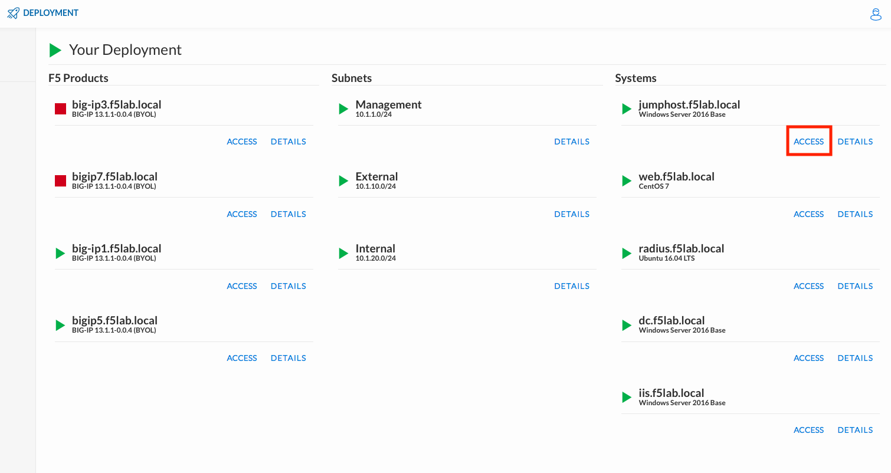
.. |image002| image:: ./media/lab02/002.png
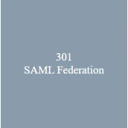
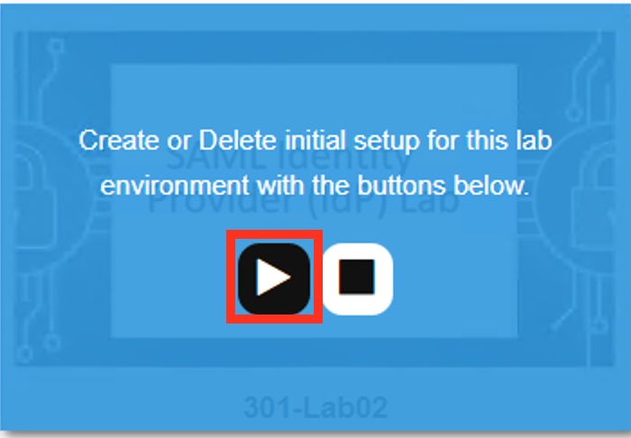
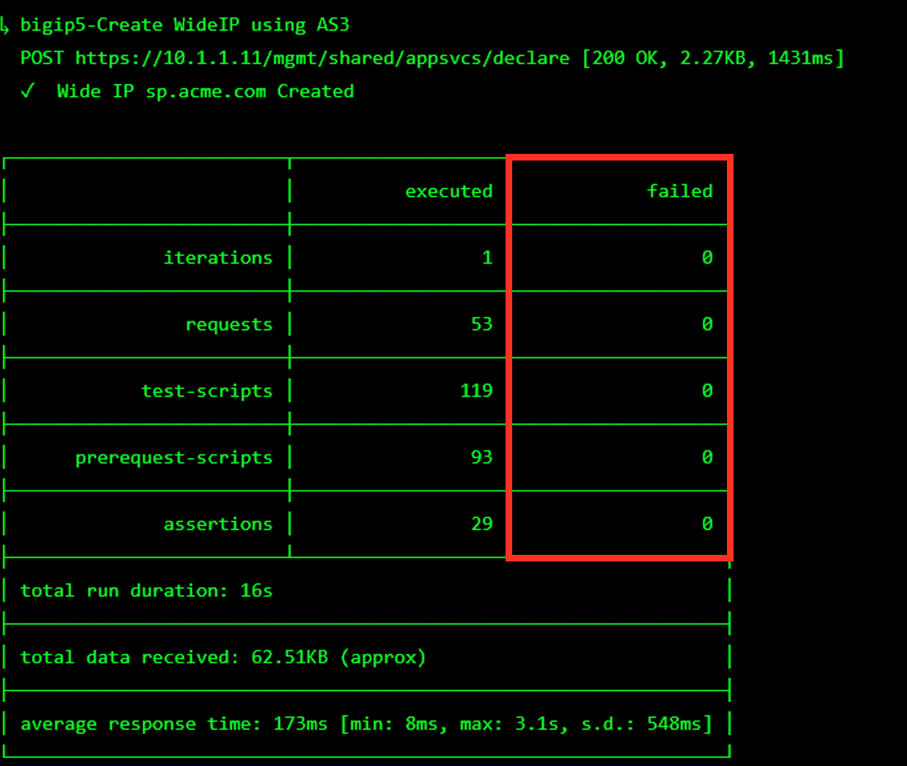
.. |image006| image:: ./media/lab02/006.png
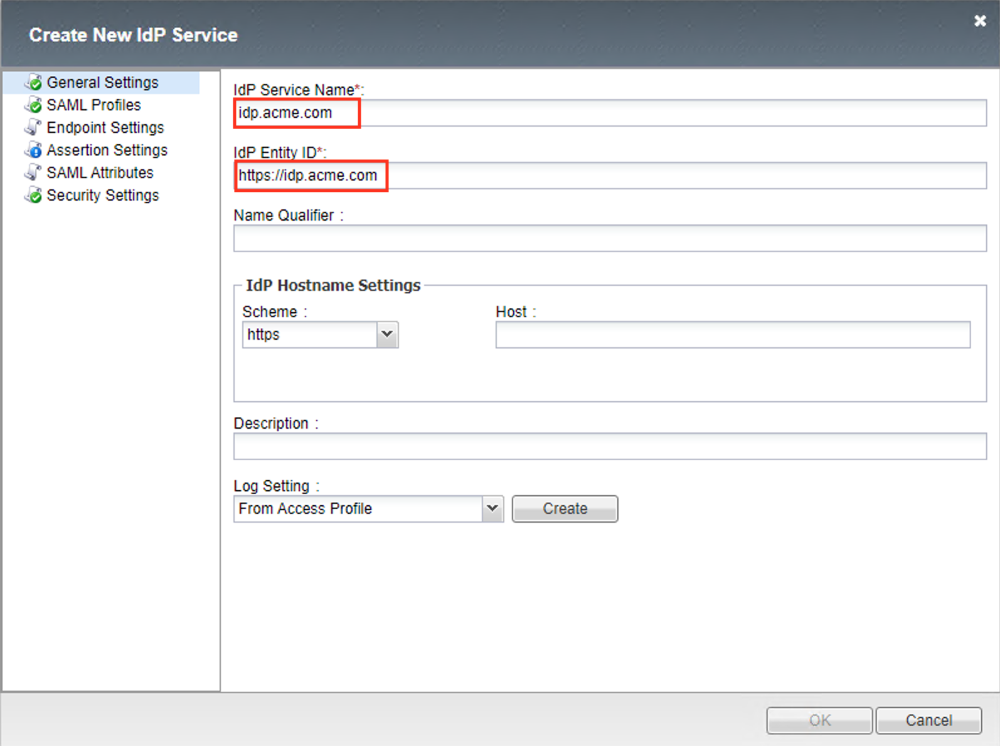
.. |image008| image:: ./media/lab02/008.png
.. |image009| image:: ./media/lab02/009.png
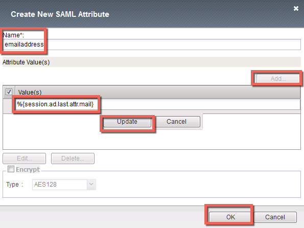
.. |image011| image:: ./media/lab02/011.png
.. |image012| image:: ./media/lab02/012.png
.. |image013| image:: ./media/lab02/013.png
.. |image014| image:: ./media/lab02/014.png
.. |image015| image:: ./media/lab02/015.png
.. |image016| image:: ./media/lab02/016.png
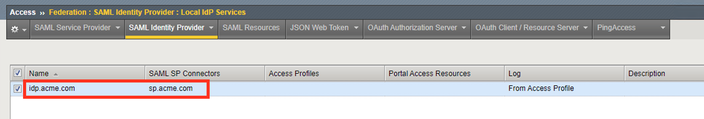
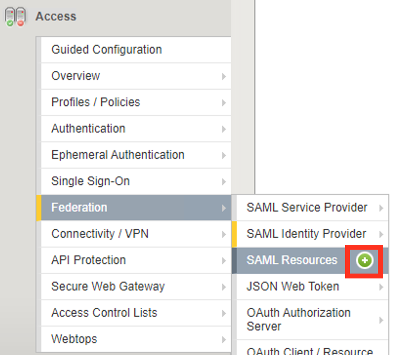
.. |image019| image:: ./media/lab02/019.png
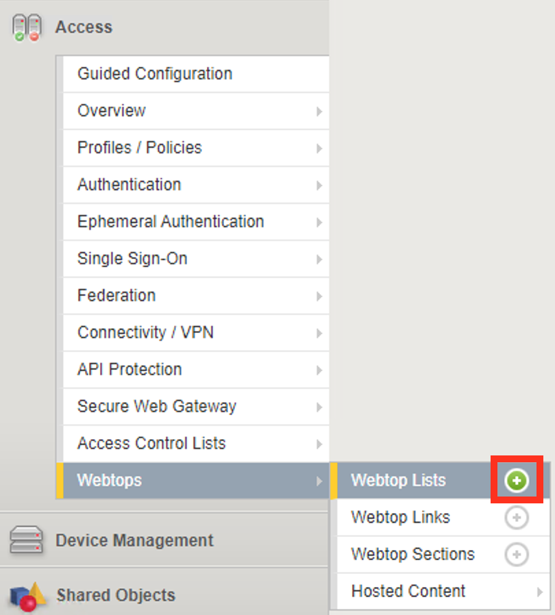
.. |image021| image:: ./media/lab02/021.png
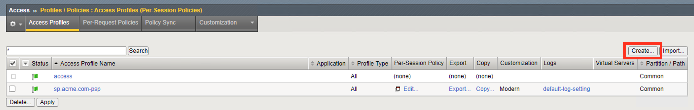
.. |image023| image:: ./media/lab02/023.png
.. |image024| image:: ./media/lab02/024.png
.. |image025| image:: ./media/lab02/025.png
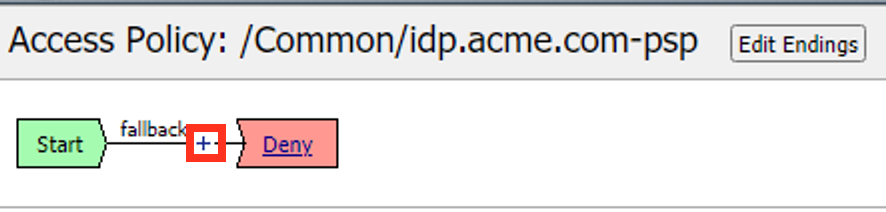
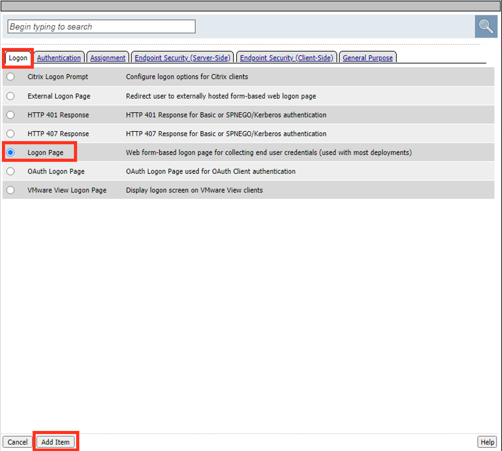
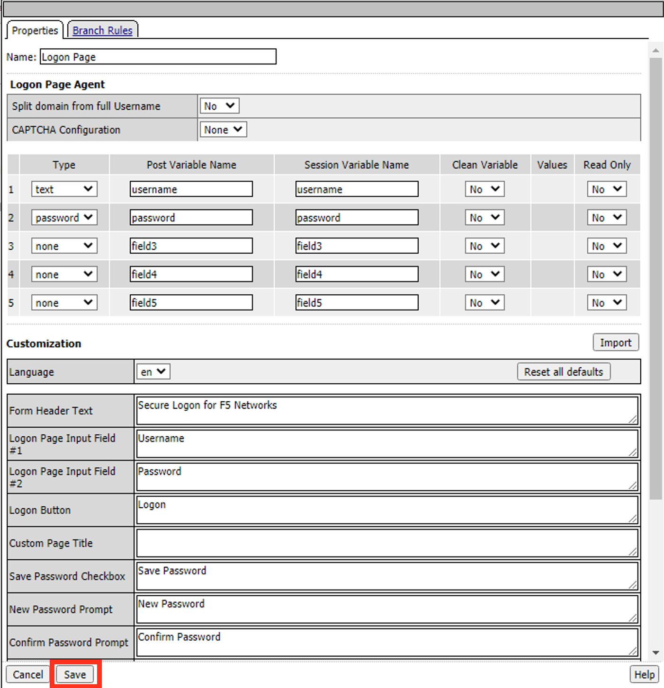
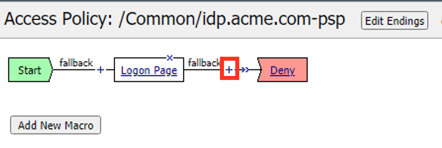
.. |image030| image:: ./media/lab02/030.png
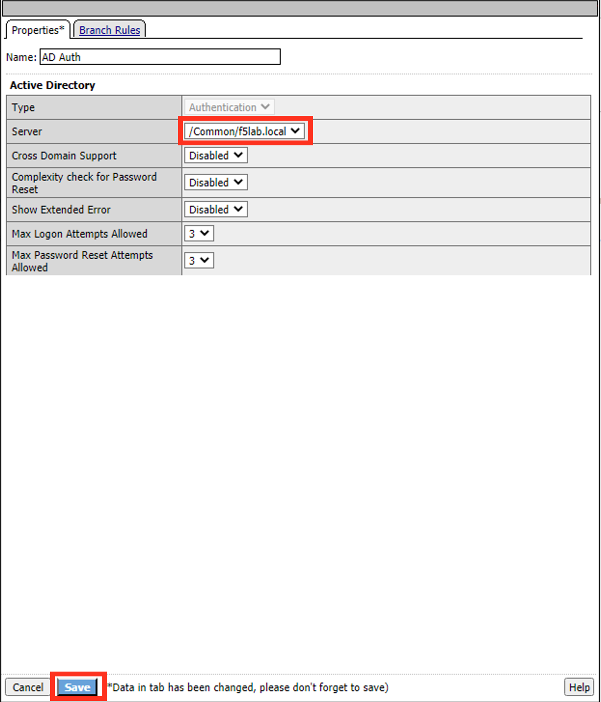
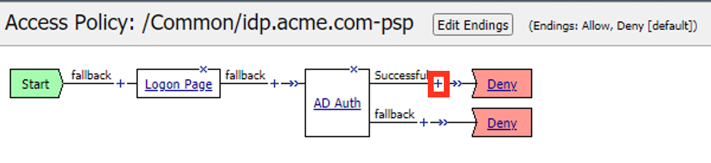
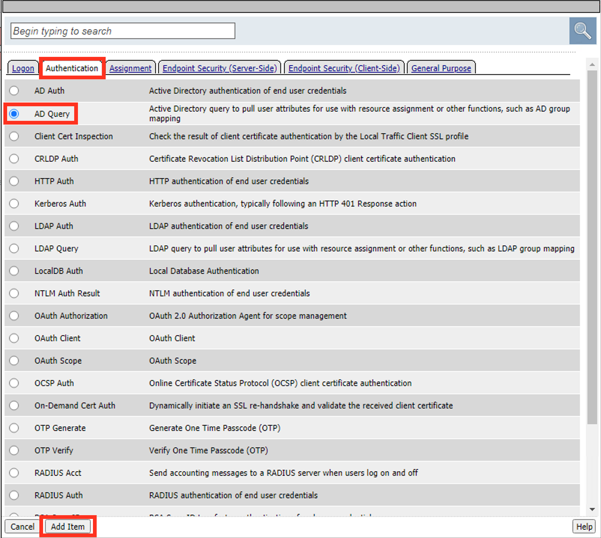
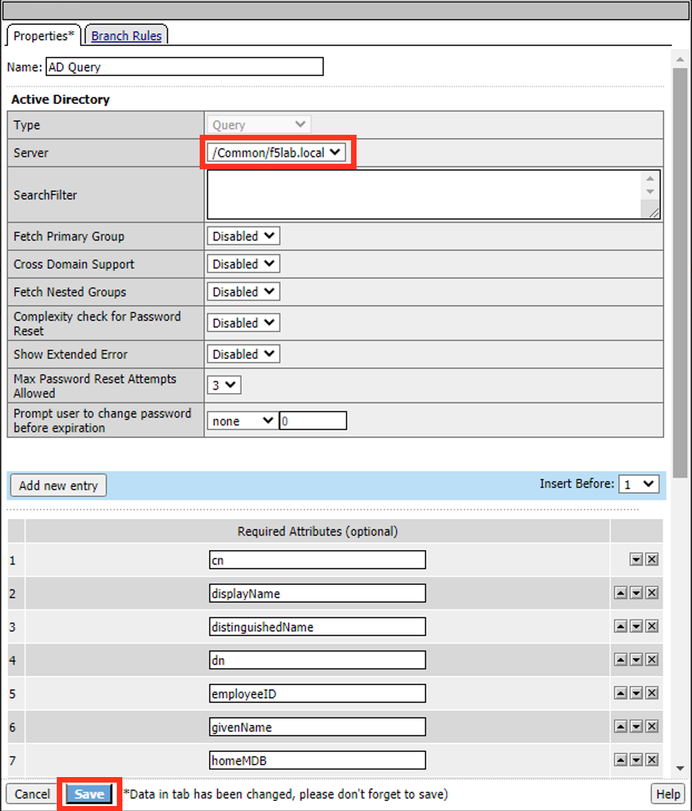
.. |image035| image:: ./media/lab02/035.png
.. |image036| image:: ./media/lab02/036.png
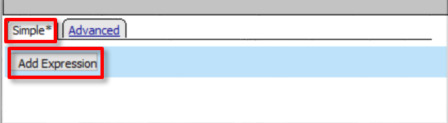
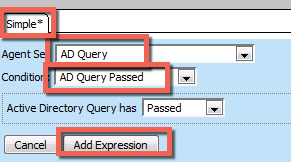