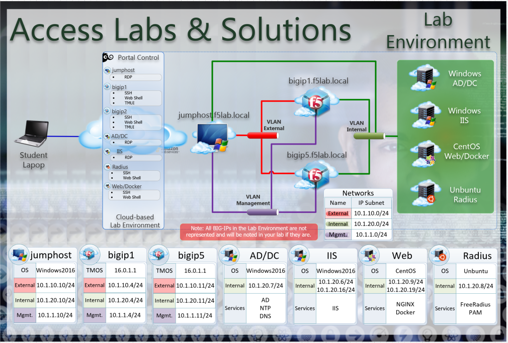

Getting Started
---------------

To access your dedicated student lab environment, you will require a web browser and Remote Desktop Protocol (RDP) client software. The web browser will be used to access the Lab Training Portal. The RDP client will be used to connect to the Jump Host, where you will be able to access the BIG-IP management interfaces (HTTPS, SSH).

#. Click **DEPLOYMENT** located on the top left corner to display the environment

#. Click **ACCESS** next to jumpbox.f5lab.local

|image001|

#. Select your RDP solution.  

#. The RDP client on your local host establishes a RDP connection to the Jump Host.

#. Login with the following credentials:
         - User: **f5lab\\user1**
         - Password: **user1**

#. After successful logon the Chrome browser will auto launch opening the site https://portal.f5lab.local.  This process usually takes 30 seconds after logon.

|image002|

#. Proceed to the lab or solution guide you wish to complete.  It that will contain further instructions on setting up the environment further from https://portal.f5lab.local.

UDF Blueprint
~~~~~~~~~~~~~~

Access Labs & Solutions Version 5

Lab Topology
~~~~~~~~~~~~

|image000|

The following components have been included in your lab environment:

- 2 x F5 BIG-IP VE (v15.1)
- 1 x Windows Jumphost- Server 2016
- 1 x Windows 2016 Server hosting AD, CA, OCSP & DNS
- 1 x Windows 2016 Server hosting IIS
- 1 x Ubuntu 16.04 LTS 
- 1 x Centos 7

Lab Components
^^^^^^^^^^^^^^

The following table lists VLANS, IP Addresses and Credentials for all
components:

+------------------------+-------------------------+--------------------------+
| Component              | VLAN/IP Address(es)     | Credentials              |
+========================+=========================+==========================+
| jumpbox.f5lab.local    | - Management 10.1.1.10  | - user1/user1            |
|                        | - External   10.1.10.10 | - user2/user2            |
|                        | - Internal   10.1.20.10 |                          |
+------------------------+-------------------------+--------------------------+
| BIG-IP1.f5lab.local    | - Management 10.1.1.4   | - admin/admin            |
|                        | - External   10.1.10.4  |                          |
|                        | - Internal   10.1.20.4  |                          |
+------------------------+-------------------------+--------------------------+
| BIG-IP2.f5lab.local    | - Management 10.1.1.5   | - admin/admin            |
|                        | - External   10.1.10.5  |                          |
|                        | - Internal   10.1.20.5  |                          |
+------------------------+-------------------------+--------------------------+
| dc.f5lab.local         | - Management 10.1.1.7   | - admin/admin            |
|                        | - Internal   10.1.20.7  |                          |
+------------------------+-------------------------+--------------------------+
| iis.f5lab.local        | - Management 10.1.1.6   | - admin/admin            |
|                        | - Internal              |                          |
|                        |    - 10.1.20.6          |                          |
|                        |    - 10.1.20.16         |                          |
+------------------------+-------------------------+--------------------------+
| web.f5lab.local        | - Management 10.1.1.9   |                          |
|                        | - Internal              |                          |
|                        |    - 10.1.20.9          |                          |
|                        |    - 10.1.20.19         |                          |
+------------------------+-------------------------+--------------------------+
| radius.f5lab.local     | - Management 10.1.1.8   |                          |
|                        | - Internal              |                          |
|                        |    - 10.1.20.8          |                          |
|                        |    - 10.1.20.18         |                          |
+------------------------+-------------------------+--------------------------+

.. |image001| image:: media/intro/001.png
.. |image002| image:: media/intro/002.png

