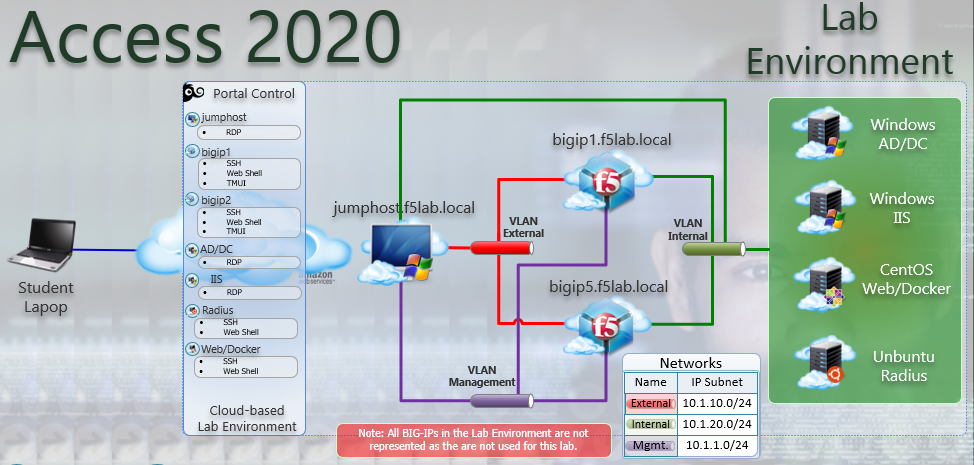

Lab Overview
---------------

An API protection profile is the primary tool that Access Policy Manager administrators use to safeguard API servers. Protection profiles define groups of related RESTful APIs used by applications. The protection profile contains a list of paths that may appear in a request. The system classifies requests and sends them to specific API servers.

The simplest way to create an API protection profile and establish API protection is using an OpenAPI Spec file to import the details of the APIs. If you use an OpenAPI Spec file, Access Policy Manager automatically creates the following (depending on what's included in the spec file):

- API Protection Profile
- Paths
- API servers
- Responses
- Per-request policy with a Request Classification agent and a subroutine containing an OAuth scope check agent

To enable API protection, the API Protection Profile must be associated with a virtual server. If using API Protection, the virtual server can have only one API Protection Profile associated with it. You cannot select other access profiles or per-request policies in that virtual server.

Lab Topology
---------------

|image000|  

The following components have been included in your lab environment:

- 2 x F5 BIG-IP VE (v15.1)
- 1 x Windows Jumphost- Server 2016
- 1 x Windows 2016 Server hosting AD, CA, OCSP & DNS
- 1 x Windows 2016 Server hosting IIS
- 1 x Ubuntu 16.04 LTS 
- 1 x Centos 7

Lab Components
------------------

The following table lists VLANS, IP Addresses and Credentials for all
components:

+------------------------+-------------------------+--------------------------+
| Component              | VLAN/IP Address(es)     | Credentials              | 
+========================+=========================+==========================+
| jumpbox.f5lab.local    | - Management 10.1.1.10  | - user1/user1            | 
|                        | - External   10.1.10.10 | - user2/user2            | 
|                        | - Internal   10.1.20.10 |                          |
+------------------------+-------------------------+--------------------------+
| BIG-IP1.f5lab.local    | - Management 10.1.1.4   | - admin/admin            | 
|                        | - External   10.1.10.4  |                          | 
|                        | - Internal   10.1.20.4  |                          |
+------------------------+-------------------------+--------------------------+
| BIG-IP3.f5lab.local    | - Management 10.1.1.5   | - admin/admin            | 
|                        | - External   10.1.10.5  |                          | 
|                        | - Internal   10.1.20.5  |                          |
+------------------------+-------------------------+--------------------------+
| dc1.f5lab.local        | - Management 10.1.1.7   | - admin/admin            | 
|                        | - Internal   10.1.20.7  |                          | 
+------------------------+-------------------------+--------------------------+
| iis.f5lab.local        | - Management 10.1.1.6   | - admin/admin            | 
|                        | - Internal   10.1.20.6  |                          | 
+------------------------+-------------------------+--------------------------+
| web.f5lab.local        | - Management 10.1.1.9   |                          | 
|                        | - Internal   10.1.20.9  |                          |
|                        | - Internal   10.1.20.19 |                          |
+------------------------+-------------------------+--------------------------+
| radius.f5lab.local     | - Management 10.1.1.8   |                          | 
|                        | - Internal   10.1.20.8  |                          | 
+------------------------+-------------------------+--------------------------+      

