Lab 1: Deploy an API Protection Profile
===========================================

Setup Lab Environment
----------------------------------------

Task - Setup Lab Environment
-----------------------------

To access your dedicated student lab environment, you will require a web browser and Remote Desktop Protocol (RDP) client software. The web browser will be used to access the Lab Training Portal. The RDP client will be used to connect to the Jump Host, where you will be able to access the BIG-IP management interfaces (HTTPS, SSH).

#. Click **DEPLOYMENT** located on the top left corner to display the environment

#. Click **ACCESS** next to jumpbox.f5lab.local

   |image200|

#. Select your RDP solution.  

#. The RDP client on your local host establishes a RDP connection to the Jump Host.

#. Login with the following credentials:
         - User: **f5lab\\user1**
         - Password: **user1**

#. After successful logon the Chrome browser will auto launch opening the site https://portal.f5lab.local.  This process usually takes 30 seconds after logon.

	|image201|

#. Click the **Classes** tab at the top of the page.

#. Scroll down the page until you see **304 API Protection** on the left

   |image202|

#. Hover over tile **Implement C3D with APM Enchancements**. A start and stop icon should appear within the tile.  Click the **Play** Button to start the automation to build the environment

   |image203|

#. The screen should refresh displaying the progress of the automation within 30 seconds.  Scroll to the bottom of the automation workflow to ensure all requests succeeded.  If you you experience errors try running the automation a second time or open an issue on the `Access Labs Repo <https://github.com/f5devcentral/access-labs>`__.

   |image204|

Section 1.1 - Create a JWT Provider
---------------------------------------

The cornerstone of the API protection profile is the ability to authorize users using JWT. Unlike Guided Configuration that creates the JWT Provider for you based on a few defined parameters, you must create the provider manually.

Task 1 - Create an Authorization Provider
~~~~~~~~~~~~~~~~~~~~~~~~~~~~~~~~~~~~~~~~~~~~~~~~~~

1. Navigate to Access >> Federation >> OAuth Client/Resource Server >> Provider. Click the **+ (Plus Symbol)**

|image3|

2. Configure the following parameters:

- Name: **api-as-provider**
- Trusted Certificate Authorities: **ca.acme.com.**
- OpenID URL: replace f5-oauth.local with **as.acme.com**

3. Click Discover

|image4|

4. The Authentication URI, Token URI, Token Validation Scope URI, and UserInfo URI should be updated

|image5|

5. Click **Save**

Task 4 - Create a JWT Provider
~~~~~~~~~~~~~~~~~~~~~~~~~~~~~~~~~~~~~~~~~~~~~~~~~~

1. Navigate to Access >> Federation >> JSON Web Token >> Provider List. Click the **+ (Plus Symbol)**

|image9|

2. Enter the name: **as-jwt-provider**

3. Click **Add** so api-as-provider is added to list of providers

4. Click **Save**

|image10|

Section 1.2 - Create an API Protection Profile
------------------------------------------------------

The API Protection profile is a combination of APM and AWAF features to protect any API.

Task 1 - Create an API Protection Profile
~~~~~~~~~~~~~~~~~~~~~~~~~~~~~~~~~~~~~~~~~~~~~~~~~~

#. Navigate to API Protection >> Profile. Click the **+ (plus symbol)**

   |image11|

.. note:: json file is located on the jumpbox in c:\\access-labs\\class3\\module4\\student_files

#. Enter the following parameters:

   - Name: **api-protection**
   - OpenAPI File: **Active Directory OpenAPI.json**
   - DNS Resolver: **internal-dns-resolver**
   - Authorization: **OAuth 2.0**

#. Click **Add**

#. Click **Save**

   |image12|

Task 2 - Explore the Path Configuration
~~~~~~~~~~~~~~~~~~~~~~~~~~~~~~~~~~~~~~~~~~~~~~~~~~

#. Note the Spec file contained four paths to various URIs

#. Each URI only supports the Method GET

#. The APIs server URL is http://adapi.f5lab.local:81

   |image13|

Task 3 - Associate a JWT Provider
~~~~~~~~~~~~~~~~~~~~~~~~~~~~~~~~~~~~~~~~~~~~~~~~~~

#. Click **Access Control** from the top ribbon

#. Click **Edit (Per Request Policy)**

   |image14|

#. Notice the same paths displayed in the API Protection profile appear here. Currently there is no fine-grained access control.  We will implement it later in the lab.

#. Click the **+ (plus symbol)** next the Subroutine **OAuth Scope Check AuthZ** to expand its properties:

   |image15|

   .. note:: The OAuth scope agent currently has a red asterisk since no provider is associated with it.

#. Click **OAuth Scope**

   |image16|

#. Enter the following parameters:

   - Token Validation Mode: **Internal**
   - JWT Provider List: **as-jwt-provider**
   - Response: **api-protection_auto_response1**

#. Click **Save**

   |image17|
   
   
Section 1.3 - Create the api.acme.com virtual server
----------------------------------------------------------

In this section, you will define which components you want to create as part of the API Protection configuration.

Task 1 - Create a virtual server
~~~~~~~~~~~~~~~~~~~~~~~~~~~~~~~~~~~~~~~~~~~~~~~~~~

1. From the web browser, click on the **Local Traffic** tab located on the left side

|image18|

2. Navigate to Virtual Servers >> Virtual Server List.  Click the **+ (plus symbol)**

|image19|

3. Enter the following parameters:

- Name: **api.acme.com**
- Destination Address/Mask: **10.1.10.102**
- Service Port: **443**
- HTTP Profile (Client): **http**
- SSL Profile(Client): **acme.com**
- Source Address Translation: **Auto Map**
- API Protection: **api-protection**

4. Click **Finished**

|image20|
|image22|

Section 1.4 - Test Course-Grained Access
-------------------------------------------

In this section, you will sample API requests to the new created api.acme.com virtual server to test functionality

Task 1 - Send a valid GET without a JWT to retrieve user1's attributes
~~~~~~~~~~~~~~~~~~~~~~~~~~~~~~~~~~~~~~~~~~~~~~~~~~~~~~~~~~~~~~~~~~~~~~~~~~~

1. From the Jumpbox, open **Postman**

|image23|

2. Expand the **API Protection** Collection, the **Agility 2020** Folder, and finally the **Lab API Requests subfolder**

3. Select the request **No JWT-Retrieve User Attributes**

|image24|

4. Click **Send**

|image25|

5. You receive a **403 Forbidden** response status code since you do not have a valid JWT

|image26|

Task 2 - Send a valid GET with JWT to retrieve user1\'s attributes
~~~~~~~~~~~~~~~~~~~~~~~~~~~~~~~~~~~~~~~~~~~~~~~~~~~~~~~~~~~~~~~~~~~~~~

1. Select the request **JWT-Retrieve User Attributes**

2. Select the **Authorization** tab

|image43|

3. Click **Get New Access Token**

|image44|

4. Enter **User1** for the Token Name and review the Postman Configuration. Nothing else should need to be modified

5. Click **Request Token**

|image27|

6. Login using Username: **user1**, Password: **user1**

|image28|

7. Click **Use Token** at the top.

|image29|

8. Notice the **Access Token** field is now populated

|image34|

9. Click **Send**

10. You receive a **200 OK** response status code with attributes for user1 in the body of the response

|image31|

Task 3 - Send a valid GET with JWT to set user1's employeeNumber
~~~~~~~~~~~~~~~~~~~~~~~~~~~~~~~~~~~~~~~~~~~~~~~~~~~~~~~~~~~~~~~~~~~`

1. Select the request **JWT-Set User Attributes**

2. Select the **Authorization** tab

3. Select the previously created **User1** token from the **Available Tokens** dropdown

|image33|

4. The **Token** field is now populated

|image34|

5. Click **Send**

.. note :: If you receive a 403 response status code, repeat steps 10-13 to request a new token.  You can change the name of the token request prior to sending by setting the Token Name.

.. note :: You can delete expired tokens by clicking the Available Tokens dropdown, clicking Manage Tokens, and then clicking the trashcan next to the Token.

6. You receive a **200 OK** response status code with a response body that contains user1's employeeNumber **123456**

|image35|

Task 4 - Send a valid GET with JWT to create a user
~~~~~~~~~~~~~~~~~~~~~~~~~~~~~~~~~~~~~~~~~~~~~~~~~~~~~~~

1. Select the request **JWT-Create User**

2. Select the **Authorization** tab

3. Select the previously created **User1** token from the **Available Tokens** dropdown

|image33|

4. Click **Send**

.. note :: If you receive a 403 response status code, repeat steps 10-13 to request a new token.  You can change the name of the token request prior to sending by setting the Token Name.

.. note :: You can delete expired tokens by clicking the Available Tokens dropdown, clicking Manage Tokens, and then clicking the trashcan next to the Token.

5. You receive a **200 OK** response status code with a response body that contains Bob Smith's user attributes
|image46|

Task 5 - Send invalid GET request with JWT to set a nonexistent user's attributes
~~~~~~~~~~~~~~~~~~~~~~~~~~~~~~~~~~~~~~~~~~~~~~~~~~~~~~~~~~~~~~~~~~~~~~~~~~~~~~~~~~~~~

1. Select the request **JWT-Set Invalid Attributes**

2. Select the **Authorization** tab

3. Select the previously created **User1** token from the **Available Tokens** dropdown

4. The **Token** field is now populated

5. Click **Send**

.. note :: If you receive a 403 response status code, repeat steps 10-13 to request a new token.  You can change the name of the token request prior to sending by setting the Token Name.

.. note :: you can delete expired tokens by clicking the Available Tokens dropdown, clicking Manage Tokens, and then clicking the trashcan next to the Token.

6. You receive a **400 Bad Request** response status code. The request successfully passed through the API Gateway, but the server failed to process the request.

|image37|

Task 6 - Send a POST request to a valid URI to set User1's attributes
~~~~~~~~~~~~~~~~~~~~~~~~~~~~~~~~~~~~~~~~~~~~~~~~~~~~~~~~~~~~~~~~~~~~~~~~

1. Select the request **JWT-Set User Attributes**

2. Select the **Authorization** tab

3. Select the previously created **User1** token from the **Available Tokens** dropdown

4. The **Token** field is now populated

5. Click **Send**

6. You receive a **403 Forbidden** response status code. This is expected because the POST Method was not specified in the API Protection Profile for the path /aduser/Set

|image39|

Task 7 - Send a GET request to an invalid URI
~~~~~~~~~~~~~~~~~~~~~~~~~~~~~~~~~~~~~~~~~~~~~~~~~~~~~~~~~~~~~~~~~~~~~~~~

1. Select the request **JWT-Invalid URI**

2. Select the **Authorization** tab

3. Select the previously created **User1** token from the **Available Tokens** dropdown

4. The **Token** field is now populated

5. Click **Send**

6. You receive a **403 Forbidden** response status code. This is expected because the path /hacker/attack was not specified in the API Protection Profile

|image39|

Section 1.5 - Implement Fine-Grained Access Controls
-----------------------------------------------------------

Up to this point any authenticated user to the API is authorized to use them. In this section we will restrict user1's ability to create users, but will still be able to modify a user's employee number.

Task 1 - Retrieve Group Membership Subsession Variable
~~~~~~~~~~~~~~~~~~~~~~~~~~~~~~~~~~~~~~~~~~~~~~~~~~~~~~~~~~~~~~~~~~~~~~~~

.. note :: In order to implement fine-grained control the session variables that contain the data must be known. This first session shows you how to display the session variables and their values.

1. From the Jumpbox desktop click on the **BIG-IP1** Putty icon

|image47|

2. Enter the command **sessiondump --delete all** to remove any existing APM sessions

|image41|

3. Enter the command **tailf /var/log/apm**.  Hit enter a few times to create some space on the screen

|image84|

4. From Postman, Select the request **JWT-Retrieve User Attributes**.  The Authorization field should already be populated with User1's token.

5. Click **Send**

6. You receive a **200 OK** response status code with attributes for user1 in the body of the response

|image31|

.. Note :: Your SessionID will be different

7. Return to the CLI and examine the logs. You will see a message about a new subsession being created. Copy the subsession ID

|image85|

8. Exit the logs using Ctrl+Z

9. Enter the command **sessiondump -subkeys <subsessionID>**

|image86|

10.  Scroll through input until you find the session variable for **subsession.oauth.scope.last.jwt.groups**

|image87|

Task 2 - Edit the per-request policy
~~~~~~~~~~~~~~~~~~~~~~~~~~~~~~~~~~~~~~~~~~~~~~~~~~~~~~~~~~~~~~~~~~~~~~~~

1. Return to BIG-IP1's management interface in the browser and click on the **Access** tab located on the left side

|image0|

2. Navigate to API Protection >> Profile.  Click **Profile** to modify the previously created API protection Profile (not the + Plus symbol)

|image48|

3. Click **Edit** Under Per-Request Policy

|image49|

4. Click the **Allow** terminal located at the end of the **GET /aduser/create** branch

|image72|

5. Select **Reject**
6. Click **Save**

|image60|
 
7. Click the **+ (Plus Symbol)** on the GET /aduser/create branch

|image50|

8. Click the **General Purpose** tab

9. Select **Empty**

10. Click **Add Item**

|image51|

11. Enter the name **Claim Check**

|image53|

12. Click the **Branch Rules** tab

13. Click the **Add Branch Rule**

|image52|

14. Enter Name **CreateUser**

15. Click **Change**

|image54|

16. Click the **Advanced** tab

17. Enter the string in the notes section to restrict access to only members of the **CreateUser** Group. Make sure the " characters are properly formatted after pasting. If they aren't, simply delete and re-enter them manually.  

18. Click **Finished**

.. Note :: 

	expr {[mcget {subsession.oauth.scope.last.jwt.groups}] contains "CreateUser"}
	
	

|image55|

19. Click **Save**

|image56|

20. Click **Reject** on the CreateUser Branch to permit access

|image57|

21. Select **Allow**

22. Click **Save**

|image58|

23. Review the Policy Flow

|image61|

Task 3 - Test the Fine-Grained Access Control with user1
~~~~~~~~~~~~~~~~~~~~~~~~~~~~~~~~~~~~~~~~~~~~~~~~~~~~~~~~~~~~~~~~~~~~~~~~

1. From Postman select the request **JWT-Create User**

2. Select the **Authorization** Tab

|image43|

3. Select the previously created **User1** token from the **Available Tokens** dropdown

4. The **Token** field is now populated

5. Click **Send**

6. You receive a **403 Forbidden** response status code when using user1. User1 does not contain the proper claim data.

|image26|

Task 4 - Test the Fine-Grained Access Control with user2
~~~~~~~~~~~~~~~~~~~~~~~~~~~~~~~~~~~~~~~~~~~~~~~~~~~~~~~~~~~~~~~~~~~~~~~~

1. Select the request **JWT-Create User**

2. Select the **Authorization** tab

3. Click **Get New Access Token**

|image44|

4. Enter **User2** for the Token Name and review the Postman Configuration. Nothing else should need to be modified
5. Click **Request Token**

|image101|

6. Login using Username: **user2**, Password: **user2**

|image62|

7. Scroll down to the token and click **Use Token**
8. The **Token** field is now populated
9. Click **Send**

10. You receive a **200 OK** response status code when using user2. User2 does contain the proper claim data

|image46|

Section 1.6 - Implement Rate Limiting
----------------------------------------

The API Protection Profile allows a BIG-IP administrator to throttle the amount of connections to an API through the use of Key Names.

Task 1 - Test pre-rate limiting Access
~~~~~~~~~~~~~~~~~~~~~~~~~~~~~~~~~~~~~~~~~~~~~~~~~~~~~~~~~~~~~~~~~~~~~~~~-

#. From Postman, Select the request **JWT-Retrieve User Attributes**

#. Click **Save**, so the current token is saved as part of the API request.

   |image88|

#. Click the **arrow** located to the right of the API Protection labs collection.

   |image89|

#. Click **Run**

   |image104|

#. Deselect all requests except **JWT-Retrieve User Attributes**

#. Set the iterations to **100**

#. Click **Run API Protection**

   |image105|

#. You receive a **200 OK** for every request. Leave Runner open

   |image92|

Task 2 - Define the rate limiting keys
~~~~~~~~~~~~~~~~~~~~~~~~~~~~~~~~~~~~~~~~~~~~~~~~~~~~~~~~~~~~~~~~~~~~~~~~

#. Navigate to API Protection >> Profile.  Click **Profile** to modify the previously created API protection Profile.  Not the + Plus symbol.

   |image48|

#. Click **api-protection**

   |image64|

#. Click **Rate Limiting** from the top ribbon

   |image69|

   .. Note ::  The API protection profile default settings contains five Key Names created, but their values are empty.  Additional Keys can be created if necessary

#. Click **api-protection_auto_rate_limiting_key1**

   |image70|

#. Enter the Key Value **%{subsession.oauth.scope.last.jwt.user}**

#. Click **Edit**

   |image71|

#. Click **api-protection_auto_rate_limiting_key2**

#. Enter the Key Value **%{subsession.oauth.scope.last.jwt.groupid}**

#. Click **Edit**

   |image73|

#. Click **api-protection_auto_rate_limiting_key3**

#. Enter the Key Value **%{subsession.oauth.scope.last.jwt.client}**

#. Click **Edit**

   |image75|

#. Click **api-protection_auto_rate_limiting_key4**

#. Enter the Key Value **%{subsession.oauth.scope.last.jwt.tier}**

#. Click **Edit**

   |image77|

#. Click **api-protection_auto_rate_limiting_key5**

#. Enter the Key Value **%{subsession.oauth.scope.last.jwt.org}**

#. Click **Edit**

   |image79|

#. Click **Save**

   |image80|

Task 3 - Create a Rate Limiting Policy
~~~~~~~~~~~~~~~~~~~~~~~~~~~~~~~~~~~~~~~~~~~~~~~~~~~~~~~~~~~~~~~~~~~~~~~~

#. Click **Create** in the rate limiting section

   |image81|

#. Enter the Name **acme-rate-limits**

#. Move all five keys under **Selected Keys**

#. Enter **10** for the number of requests per minute

#. Enter **5** for the number requests per second

#. Click **Add**.

   |image82|

#. Click **Save**

   |image83|

Task 4 - Apply the Rate Limiting Policy
~~~~~~~~~~~~~~~~~~~~~~~~~~~~~~~~~~~~~~~~~~~~~~~~~~~~~~~~~~~~~~~~~~~~~~~~

#. Click **Access Control** from the ribbon

   |image93|

#. Click **Edit** Per Request Policy

   |image94|

#. Click the **+ (Plus Symbol)** on the **Out** branch of the **OAuth Scope Check AuthZ** Macro

   |image95|

#. Click the **Traffic Management** tab

#. Select **API Rate Limiting**

#. Click **Add Item**

   |image96|

#. Click **Add new entry**

#. Select **acme-rate-limits**

#. Click **Save**

   |image97|

#. Verify the Rate Limiting agent now appears in the appropriate location

   |image98|

Task 5 - Test Rate Limiting
~~~~~~~~~~~~~~~~~~~~~~~~~~~~~~~~~~~~~~~~~~~~~~~~~~~~~~~~~~~~~~~~~~~~~~~~

#. From Postman, return to Runner

   |image89|

#. Click **Retry** to rerun the request an additional 100 times.

   |image103|

#. On the 6th request you begin to receive a **429 Too Many Requests** response status code

   |image99|
   
   
Section 1.7 - Onboard a New API
----------------------------------------

Organizations change. With this change, new APIs are introduced requiring modifications to the API Gateway. In this section you will learn how to add additional paths.

Task 1 - Verify no access to API
~~~~~~~~~~~~~~~~~~~~~~~~~~~~~~~~~~~~~~~~~~~~~~~~~~~~~~~~~~~~~~~~~~~~~~~~

1. From Postman, select the request **JWT-Change User Password**

2. Select the **Authorization** tab

3. Select the previously created **User1** token from the **Available Tokens** dropdown

|image33|

4. The **Token** field is now populated

|image34|

5. Click **Send**

6. You receive a **403 Forbidden** response status code because the the new API has not been published at the Gateway. WARNING: If you executed this step too quickly after the prior 1.6 lab, you may still be rate limited and need to wait a minute.

|image39|

Task 2 - Add the new API path
~~~~~~~~~~~~~~~~~~~~~~~~~~~~~~~~~~~~~~~~~~~~~~~~~~~~~~~~~~~~~~~~~~~~~~~~

1. From the browser, navigate to API Protection >> Profile.  Click **Profile** to modify the previously created API protection Profile (not the + Plus symbol)

|image48|

2. Click **API-Protection**

|image64|

3. Click **Paths**

|image65|

4. Click **Create**

|image66|

5. The URI **/aduser/password**

6. Select the Method **PATCH**

7. Click **Add**

|image67|

8. Click **Save**

|image68|

Task 3 - Test Access to the new path
~~~~~~~~~~~~~~~~~~~~~~~~~~~~~~~~~~~~~~~~~~~~~~~~~~~~~~~~~~~~~~~~~~~~~~~~

1. From Postman, select the request **JWT-Change User Password**

2. Select the **Authorization** tab

3. Select the previously created **User1** token from the **Available Tokens** dropdown

|image33|

4. The **Token** field is now populated

|image34|

5. Click **Send**

6. You receive a **200 OK** that the endpoint is now published.

|image102|

.. |image0| image:: media/lab01/image000.png
	:width: 800px
.. |image1| image:: media/lab01/image001.png	
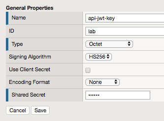
.. |image3| image:: media/lab01/image003.png
.. |image4| image:: media/lab01/image004.png

.. |image6| image:: media/lab01/image006.png
	:width: 800px	
.. |image7| image:: media/lab01/image007.png
.. |image8| image:: media/lab01/image008.png
.. |image9| image:: media/lab01/image009.png
.. |image10| image:: media/lab01/image010.png
.. |image11| image:: media/lab01/image011.png
.. |image12| image:: media/lab01/image012.png
	:width: 800px	
.. |image13| image:: media/lab01/image013.png
	:width: 800px	

.. |image15| image:: media/lab01/image015.png
	:width: 800px	
.. |image16| image:: media/lab01/image016.png
	:width: 800px	
.. |image17| image:: media/lab01/image017.png
	:width: 800px
.. |image18| image:: media/lab01/image018.png
.. |image19| image:: media/lab01/image019.png
.. |image20| image:: media/lab01/image020.png
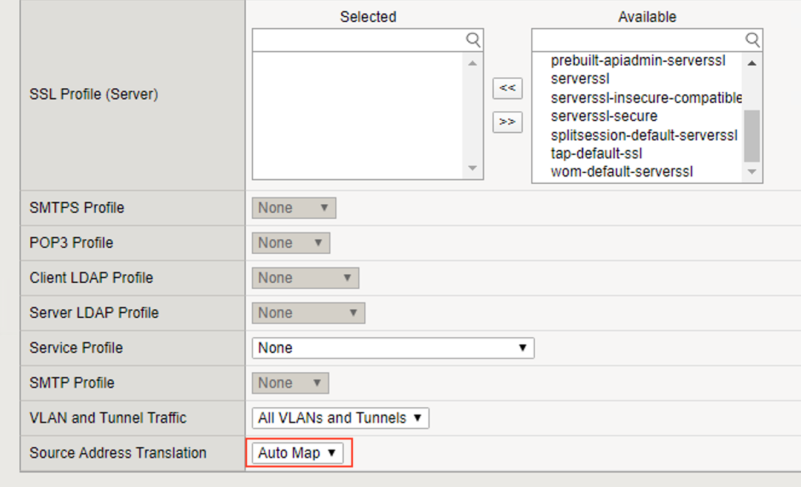
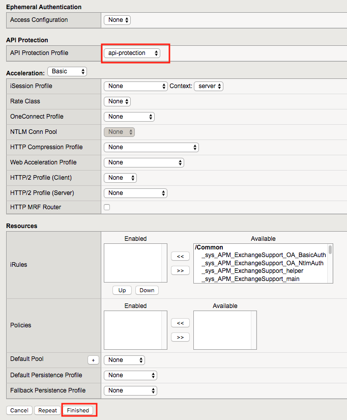

.. |image25| image:: media/lab01/image025.png
.. |image26| image:: media/lab01/image026.png
.. |image27| image:: media/lab01/image027.png
	:width: 600px
.. |image28| image:: media/lab01/image028.png
.. |image29| image:: media/lab01/image029.png
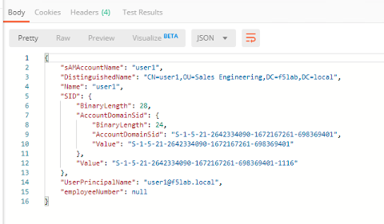
.. |image32| image:: media/lab01/image032.png
.. |image33| image:: media/lab01/image033.png
	:width: 800px
.. |image34| image:: media/lab01/image034.png
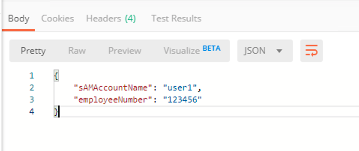
.. |image36| image:: media/lab01/image036.png
.. |image37| image:: media/lab01/image037.png
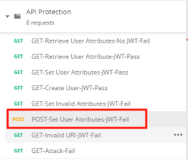
.. |image39| image:: media/lab01/image039.png
.. |image40| image:: media/lab01/image040.png
.. |image41| image:: media/lab01/image041.png
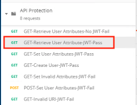
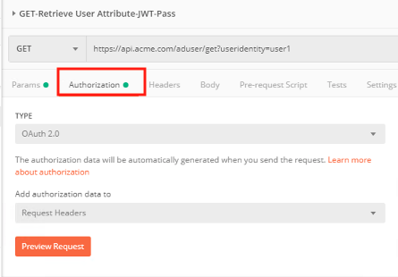
.. |image44| image:: media/lab01/image044.png
.. |image45| image:: media/lab01/image045.png
.. |image46| image:: media/lab01/image046.png
.. |image47| image:: media/lab01/image047.png
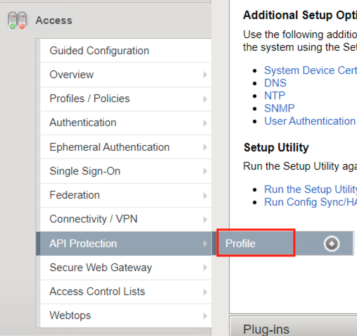
.. |image49| image:: media/lab01/image049.png
	:width: 800px
.. |image50| image:: media/lab01/image050.png
.. |image51| image:: media/lab01/image051.png
.. |image52| image:: media/lab01/image052.png
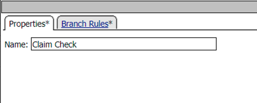
.. |image54| image:: media/lab01/image054.png

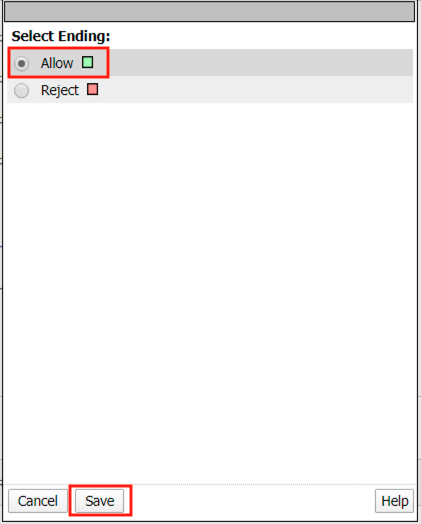
.. |image59| image:: media/lab01/image059.png
.. |image60| image:: media/lab01/image060.png
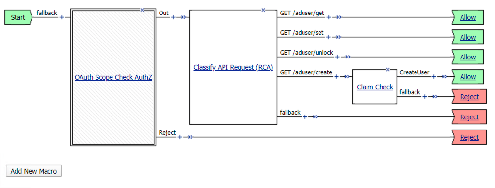
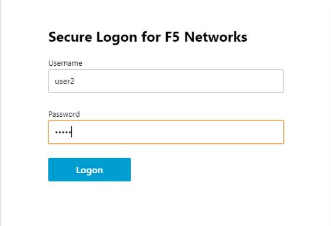
.. |image63| image:: media/lab01/image063.png
.. |image64| image:: media/lab01/image064.png
.. |image65| image:: media/lab01/image065.png

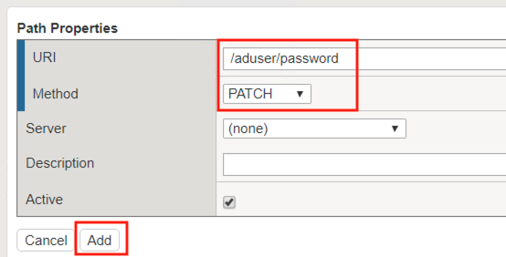
.. |image68| image:: media/lab01/image068.png
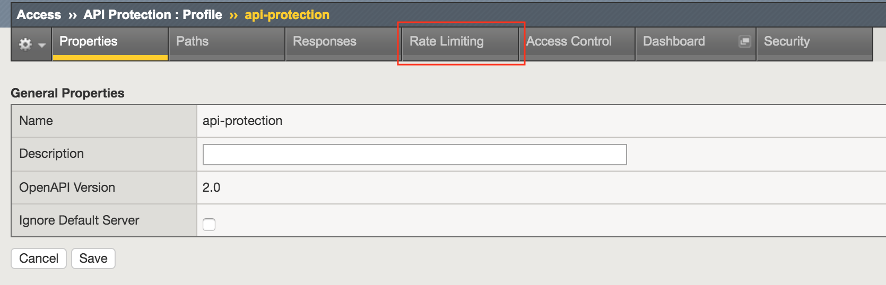
.. |image70| image:: media/lab01/image070.png
	:width: 1000px
.. |image71| image:: media/lab01/image071.png
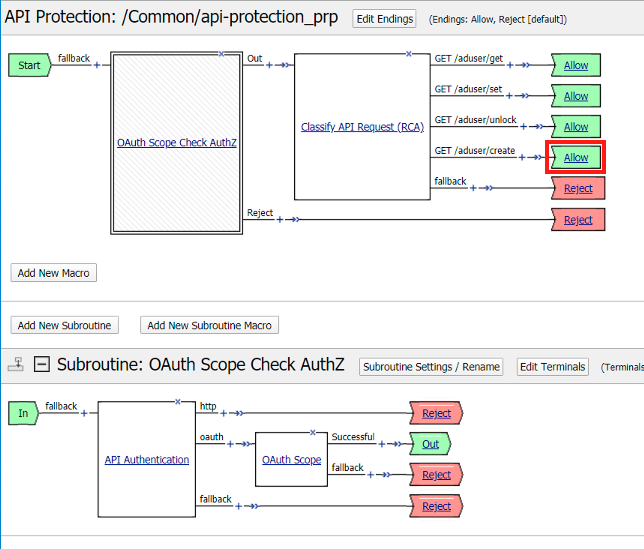
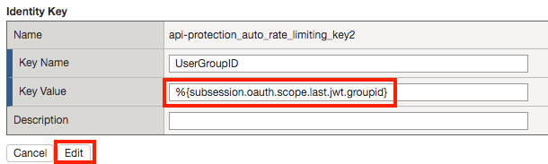
.. |image75| image:: media/lab01/image075.png
.. |image77| image:: media/lab01/image077.png
.. |image79| image:: media/lab01/image079.png
.. |image80| image:: media/lab01/image080.png
	:width: 1200px
.. |image81| image:: media/lab01/image081.png
	:width: 1000px
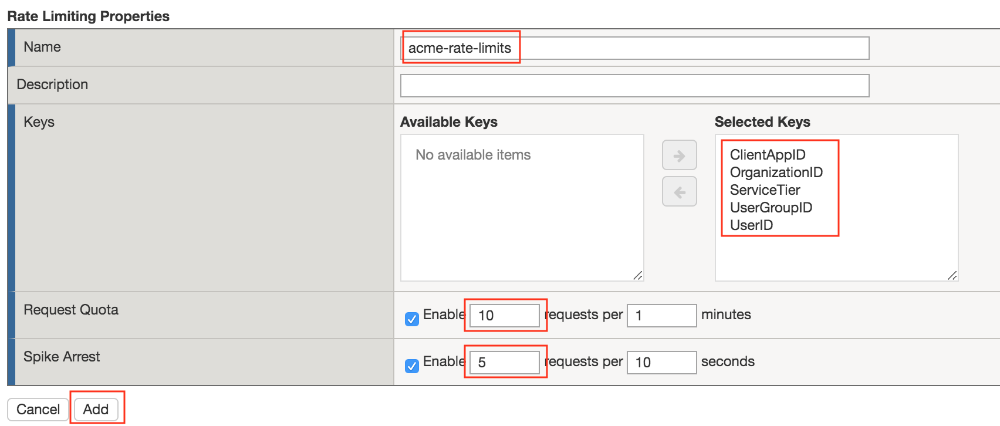
.. |image83| image:: media/lab01/image083.png
	:width: 1200px
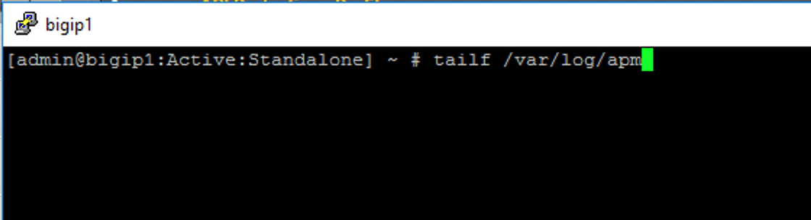
.. |image85| image:: media/lab01/image085.png
	:width: 1200px
.. |image86| image:: media/lab01/image086.png
	:width: 1200px
.. |image87| image:: media/lab01/image087.png
	:width: 1200px
.. |image88| image:: media/lab01/image088.png
	:width: 800px
.. |image89| image:: media/lab01/image089.png

.. |image92| image:: media/lab01/image092.png
	:width: 800px

.. |image95| image:: media/lab01/image095.png
	:width: 800px
.. |image96| image:: media/lab01/image096.png
	:width: 800px

.. |image98| image:: media/lab01/image098.png
	:width: 800px
.. |image99| image:: media/lab01/image099.png
	:width: 800px
.. |image101| image:: media/lab01/image101.png
.. |image103| image:: media/lab01/image103.png
	:width: 800px
.. |image102| image:: media/lab01/image102.png
.. |image103| image:: media/lab01/image103.png
	:width: 800px
.. |image104| image:: media/lab01/image104.png
.. |image105| image:: media/lab01/image105.png
.. |image200| image:: media/lab01/image200.png
.. |image201| image:: media/lab01/image201.png
.. |image202| image:: media/lab01/image202.png
.. |image203| image:: media/lab01/image203.png
.. |image204| image:: media/lab01/image204.png
.. |image205| image:: media/lab01/image205.png

