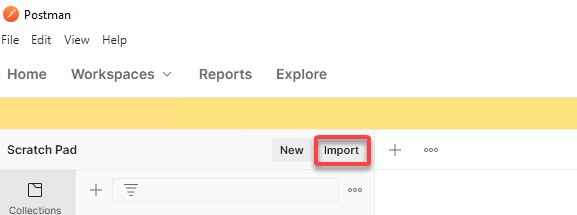

Lab 1: SAML Service Provider(SP)
=====================================

In this lab you will learn how to create and delete Access related objects.

Task 1 - Import Postman Collections
-----------------------------------------------------------------------

#. From the Jumpbox, open **Postman** via the desktop shortcut or toolbar at the bottom

    |image001|

#. Click **Yes** if prompted for "Do you want to allow this app to make changes to your device?"

    |image002|

#. Click **Import** located on the top right of the Postman application

    |image003|

#.  Click **Upload Files** 

    |image004|

#. Navigate to C:\access-labs\class4\module1\student_files, select **student-class4-module1-lab1.postman_collection.json**, and click **Open**

    |image005|

#.  Click **Import**

    |image006|

Task 2 - Import IDP Signing Certificate
-----------------------------------------------------------------------

#. Expand the **student-class4-module1-lab1** collection to see the subfolders and requests.

   |image007|

#. Select the **bigip-import-cert-idp** request.

#. Notice the request endpoint is **/mgmt/shared/file-transfer/uploads**.  This endpoint allows us to upload files to the /var/config/rest/downloads directory on the BIG-IP. 

    ..note:: If you unfamiliar with Postman the information in curly braces are variables that have been defined inside the collection.  If you wish the see the variable values simply click the three dots on the collection that allow you display more options. Click Edit and then Variables.

#. Click **Body** to display what will be passed in the POST request

   ..note:: The request contains only the PEM formated certificate of our AzureAD Identity Provider. 

    |image008|

#. Click the blue **Send** button in the upper right corner

#.  In the esponse body we see where the file is stored and its file name.  

    |image009|

#. Select the **bigip-install-cert-idp** request.

#. Examine the body of this request.  This request installs the certicate we previously uploaded to the BIG-IPs crypte store.

    |image010|

#. Click the blue **Send** button in the upper right corner

#. In the response body we a see certficate named **class4-module1-lab1-idp** has been installed to the crypto store.

    |image011|

Task 2 - Create an SAML IDP Connector 
-----------------------------------------------------------------------

In order to create an SP service the IDP Connector must exist first .  This is because the SP Service endpoint contains the binding information to the IDP Connector.

#. Select the **bigip-create-idp connector-azuread** request

#.  Notice the request endpoint is **/mgmt/tm/apm/aaa/saml-idp-connector/**. 

#. Click **Body** to display what will be passed in the POST request.  The body contains all the necessary setting in order to integrate with AzureAD.  

    |image012|

#. Click the blue **Send** button in the upper right corner

#. The response body contains all of the information related the connector and links to locations other endpoints that are related to this connectors configuration.

    |image013|

 Task 3 - Create an SAML SP Service
-----------------------------------------------------------------------   

#. Select the **bigip-create-sp service-bigip

#. Notice the request endpoint is **/mgmt/tm/apm/aaa/saml/**.

#. Click **Body** to display what will be passed in the POST request.  The body contains all the necessary setting for the SP service, plus a binding the IDP Connector we just created. 

    |image014|

#. Click the blue **Send** button in the upper right corner

#. The response body contains all of the information related the SP Service and links to locations other endpoints that are related to this SP Services configuration.

    |image015|

 Task 4 - Explore the BIG-IP GUI
-----------------------------------------------------------------------

#. Step 1

.. |image001| image:: media/lab01/001.png
.. |image002| image:: media/lab01/002.png

.. |image004| image:: media/lab01/004.png
.. |image005| image:: media/lab01/005.png
.. |image006| image:: media/lab01/006.png
.. |image007| image:: media/lab01/007.png
.. |image008| image:: media/lab01/008.png
.. |image009| image:: media/lab01/009.png

.. |image011| image:: media/lab01/011.png

