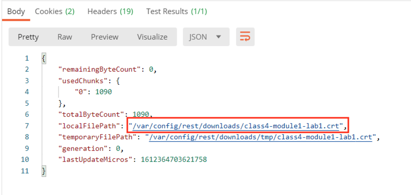

Lab 1: SAML Service Provider(SP)
=====================================

In this lab you will learn how to create and delete Access related objects.

Task 1 - Import Postman Collections
-----------------------------------------------------------------------

#. From the Jumpbox, open **Postman** via the desktop shortcut or toolbar at the bottom

    |image001|

#. Click **Yes** if prompted for "Do you want to allow this app to make changes to your device?"

    |image002|

#. Click **Import** located on the top right of the Postman application

    |image003|

#.  Click **Upload Files** 

    |image004|

#. Navigate to C:\access-labs\class4\module1\student_files, select **student-class4-module1-lab1.postman_collection.json**, and click **Open**

    |image005|

#  Click **Import**

    |image006|

#. Expand the **student-class4-module1-lab1** collection to see the subfolders and requests.

   |image007|

#. Select the **bigip-import-cert-idp** request.

#. Notice the request endpoint is **/mgmt/shared/file-transfer/uploads**.  This endpoint allows us to upload files to the /var/config/rest/downloads directory on the BIG-IP. 

..note:: If you unfamiliar with Postman the information in curly braces are variables that have been defined inside the collection.  If you wish the see the variable values simply click the three dots on the collection that allow you display more options. Click Edit and then Variables.

#. Click **Body** to display what will be passed in the POST request

   ..note:: The request contains only the PEM formated certificate of our AzureAD Identity Provider. 

    |image008|

#. Click the blue **Send** button in the upper right corner

#  Notice in the response body we see where the file is stored and its file name.  

    |image009|

.. |image001| image:: media/lab01/001.png
.. |image002| image:: media/lab01/002.png
.. |image003| image:: media/lab01/003.png
.. |image004| image:: media/lab01/004.png
.. |image005| image:: media/lab01/005.png

