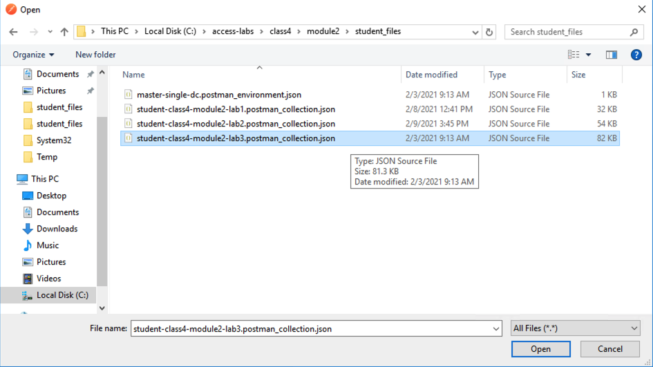
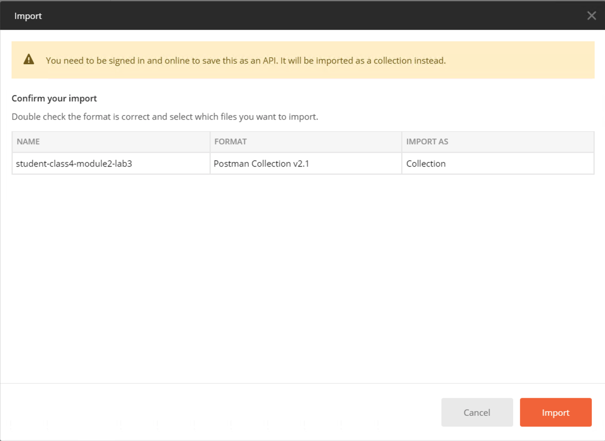
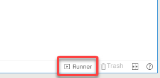
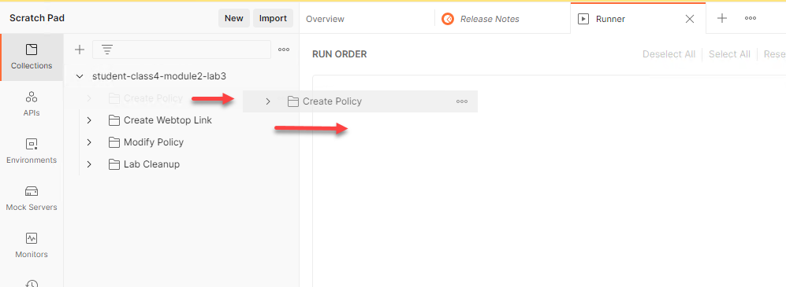
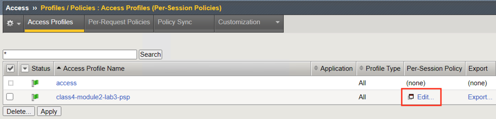
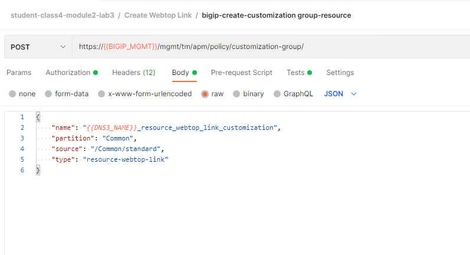
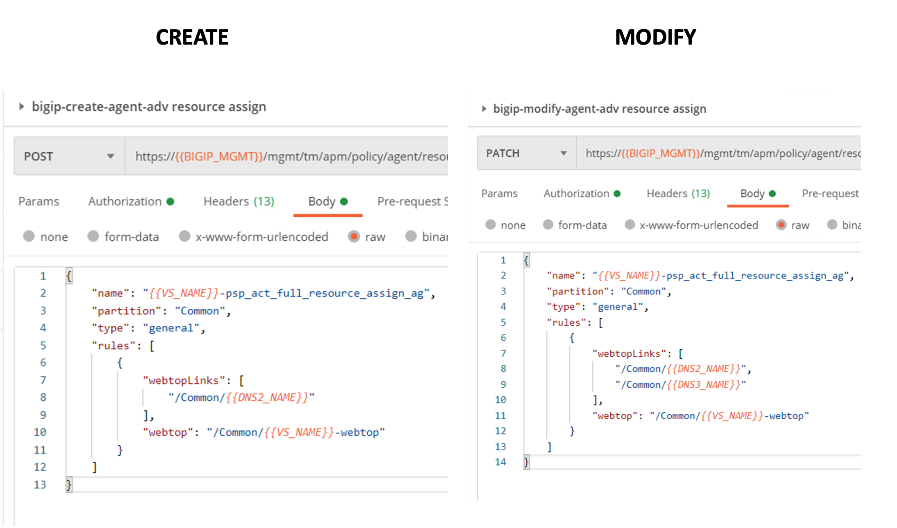
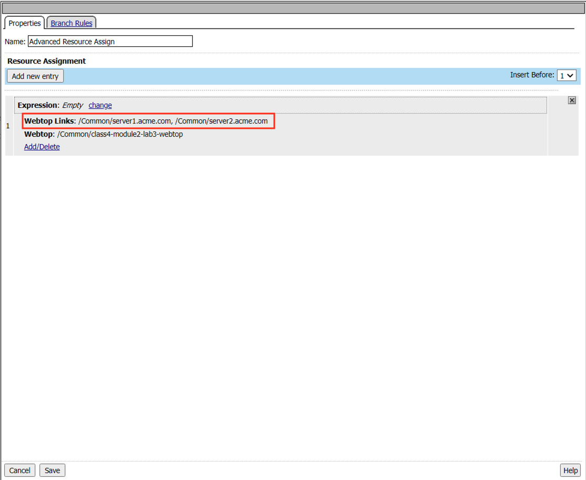
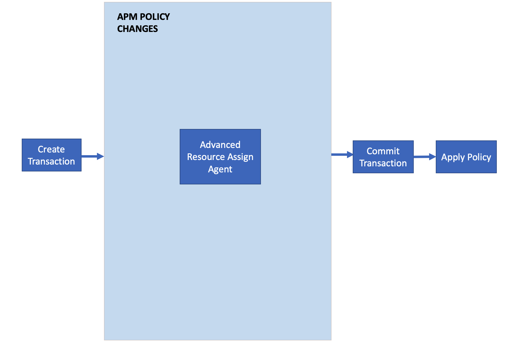

Lab 3: Add a Webtop link to an existing Webtop
==============================================

In this lab your will learn about the API calls necessary to modify an existing webtop by adding a new link to the Access Policy .  The Graphic below depicts the basic flow required for modifing policy via API.

    |image100|

Task 1 - Import Postman Collections
-----------------------------------------------------------------------

#. From the Jumpbox, open **Postman** via the desktop shortcut or toolbar at the bottom

    |image001|

#. Click **Yes** if prompted for "Do you want to allow this app to make changes to your device?"

    |image002|

#. Click **Import** located on the top left of the Postman application

    |image003|

#.  Click **Upload Files** 

    |image004|

#. Navigate to C:\\access-labs\\class4\\module2\\student_files, select **student-class4-module2-lab3.postman_collection.json**, and click **Open**

    |image005|

#.  Click **Import**

    |image006|

#. A collection called **student-class4-module2-lab3** will appear on the left side in Postman

Task 2 - Create A Webtop Policy
-----------------------------------------------------------------------

#.  Hover over the Collection name **student-class4-module2-lab3** with your mouse and click the **Arrow** icon.

    |image007|

#. Click the **Create Access Objects** folder. You will see two subfolders in the folder.

    |image008|

#.  Click the blue **Run**  button and Postman Runner will open.

    |image009|

#. Click the blue button **Run student-class...** and the API requests will start being sent to the BIG-IP.

    |image010|

#. The **Pass** circle will display a value 10.   
    
    |image011|

#. Open a browser and navigate to https://bigip1.f5lab.local

#. Login to the BIG-IP GUI with the following credentials:
        - Username: **admin**
        - Password: **admin**

#. Navigate to Access>>Profiles/Policies>>Access Profiles (Per-Session Policies).  Do not click the plus symbol.

    |image012|

#. The policy **class4-module2-lab3-psp** you created via automation is displayed.  Click **Edit** to view the policy in Visual Policy Editor(VPE).

    |image013|

#. The policy was successfully deployed using SAML Authenticaiton and an Advanced Resource Assign. Click on the **Advanced Resource Assign** Policy Item.

    |image014|

#. The Advanced Resource Assign contains a webtop and a single webtop link.  

    |image015|
    

Task 3 - Add a Webtop Link to an Advanced Resource Assign
-----------------------------------------------------------------------

.. |image001| image:: media/lab03/001.png
.. |image002| image:: media/lab03/002.png
.. |image003| image:: media/lab03/003.png
.. |image004| image:: media/lab03/004.png

.. |image010| image:: media/lab03/010.png

.. |image012| image:: media/lab03/012.png

.. |image023| image:: media/lab03/023.png
.. |image024| image:: media/lab03/024.png

.. |image026| image:: media/lab03/026.png

.. |image030| image:: media/lab03/030.png
.. |image031| image:: media/lab03/031.png

