Lab 1: Create a Empty Per-Session Policy
==========================================

In this lab your will learn about the API calls necessary to build an clean Access Policy as if you had clicked create from GUI.  The Graphic below depicts the basic flow required for creating a policy via API.

    |image100|

Task 1 - Import Postman Collections
-----------------------------------------------------------------------

#. From the Jumpbox, open **Postman** via the desktop shortcut or toolbar at the bottom

    |image001|

#. Click **Yes** if prompted for "Do you want to allow this app to make changes to your device?"

    |image002|

#. Click **Import** located on the top right of the Postman application

    |image003|

#.  Click **Upload Files** 

    |image004|

#. Navigate to C:\access-labs\class4\module2\student_files, select **student-class4-module2-lab1.postman_collection.json**, and click **Open**

    |image005|

#.  Click **Import**

    |image006|

#. A collection called **student-class4-module1-lab1** will appear on the left side in Postman

Task 2 - Explore the icontrolRest Endpoints
-----------------------------------------------------------------------

#. Expand the **student-class4-module2-lab1** collection to see the subfolders to see the request in the **Create Transaction** folder.

    |image007|

#.  Click on the request **bigip-create-transaction**

    ..note::  When creating or modifying a policy it must be performed within a transaction.  A transaction occurs in multiple steps.  First you create the transation by receiving a transaction ID from the BIG-IP.  Next, you pass subsequent requets along with the transaction ID to the BIG-IP.  The BIG-IP does not process these requests.  Instead it holds those requests until the the transaction is commited in it's final step.  It's important to understand that transactions have an all or nothing approach.  Either every request in the transaction is process sucessfully or none of them are.  For APM polciese this is extremely important to ensure Policies contain all the necessary information to buid a working policy.

#. Click on Body.   Notice the only thing in body are open and close curly braces

    |image008|

#. Click on Tests.  In Postman Tests are performed after the response from the endpoint is retreived.  This javascript parses the response body for the transId and saves it as a variable for use in subsequent requests.

    |image009|

#. Click the blue **send** button in the upper right corner.

#. You will receive a 200 OK.  The response body contains the transaction ID. Also, notice that there is a default timeout value of 300 seconds for the transaction to complete.

    |image010|

#. Expand the **Baseline Customization Groups** subfolder.  There are five customization groups created anytime a APM Per-Session Policy is created and they are mandatory. A customization Group defines the look of a particualar object such as the different between the logout page prior 15.0. Not all policy-items have a customization group.  The best way to think about it is if the object is enduser facing or not.  All enduser facing items such as logon pages, webtops, logout pages all have customization groups.  Where as something such as a Active Directory Authenticatino will not.

#. Click **bigip-create-customization group-logout**

#. Click on **Headers**.  Notice there is header inserted into the request call **X-F5-REST-Coordination-Id** that references a Postman variable.  That variable contains the transId stored from the previous **bigip-create-transaction** request.  All Requests inside the transaction MUST have that header except for the last request that commits the transaction

    |image011|

#. Cick on the body of the Customziation is done by setting the **source** key to either **/Common/modern** or **/Common/standard**. This lab uses a Postman variables that references **/Common/standard**.

    |image012|

#. The four remaining requests in Baseline customization Groups subfolder all look the same except the value of the key **type** is different.  If click through you will notice they all hit the same endpoint of **/mgmt/tm/apm/policy/customization-group**

#. Expand the **Deny Ending** subfolder

    |image013|

#.  Notice that to create a single ending in the policy it takes three requests.  A good rule of thumb is going to be that for every object that you would build in manually in Visual Policy Editor that it will takes threee Requests.  First one defines the **customiztion group**, the second to define and **agent** and the third to define the **policy-item**.  

#. Click **bigip-create-customization group-end Deny**.  This customization group request is same as all previous requests except for the name and the value of the **type** key is **logout**

#. Click *bigip-create-agent-deny ending**.  The easiest way to descibe an agent is it contains the operatinal settings for that object. For example an AD authentication agent would contain the list of AD servers to be used or with a SAMl Agent it would contain the SAML Service Provider to be used.  In the case of a ending it will contain the previously defined customization group.

#. Notice the endpoint is **/mgmt/tm/apm/policy/agent/ending-deny**. Each agent type has it's own endpoint unlike customiztion groups.  

    |image014|

#. Click **bigip-create-policy item-Deny ending**.  A Policy-Item typically contains all the setting related to its placement in the flow such as branch rules. Since this is an ending we will not see any branch rules but see references to this policy-item after a few more steps. Additional settings of how the ending is displays in Visual Policy Editor are also specified here such as caption and color. Lastly there will always be a reference to an Agent via it's name.  You can see the name of the agent specificed is the agent we created in the previous request.

    |image015|

#. Expand the **Allow Ending** subfolder

    |image016|

#. Notice there is only an agent and policy-item.  There is not a customization group.  That's because if the connection is allowed the user will not be see any displayed from APM.  This example of a policy item of an object that is not end user facing.

#. Click **Body**.  Notice the only of the allow allow agent only contains the name and partition.

    |image017|

#. Click **bigip-create-policy item-allow ending**.  Then, Click **Body**.

    

#. The stucture of the allow ending is similiar to the previous deny ending.  Since this is an ending it doesn't contain any branch rules.  

    |image018|

#. Expand the **Start Item** subfolder and notice their is only a single request.  There is not an agent or customization group required for the start-item.

    |image019|

.. |image001| image:: media/lab01/001.png
.. |image002| image:: media/lab01/002.png
.. |image003| image:: media/lab01/003.png
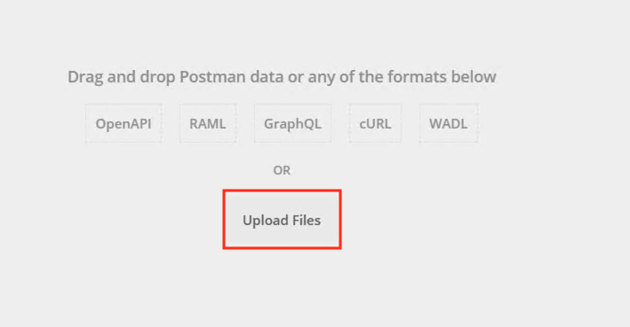
.. |image005| image:: media/lab01/005.png
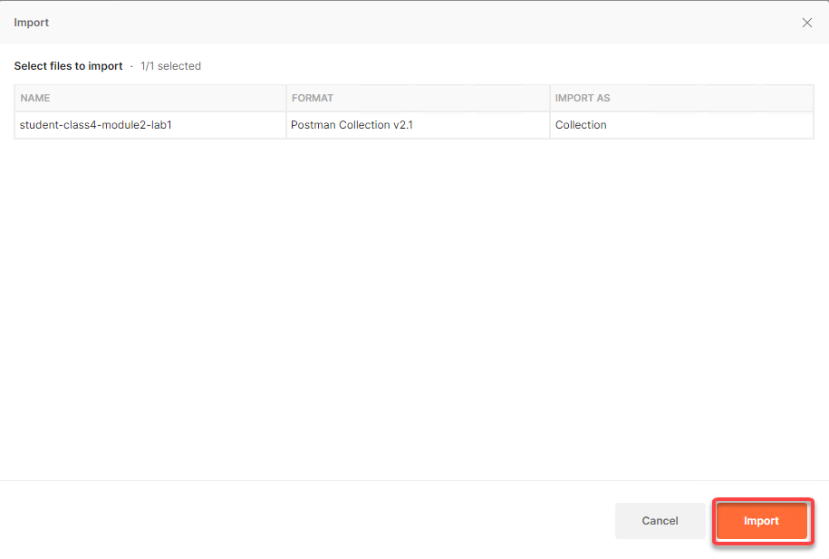
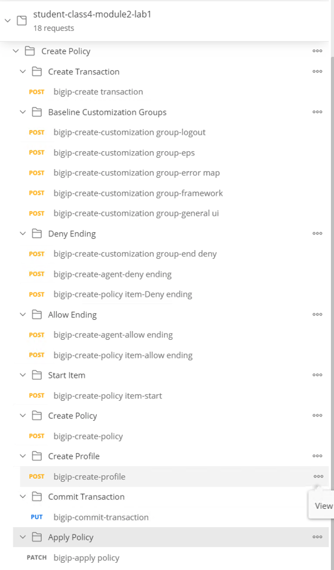
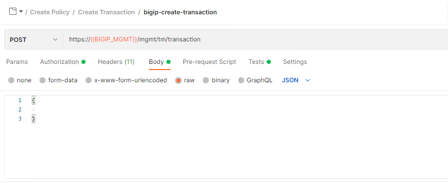
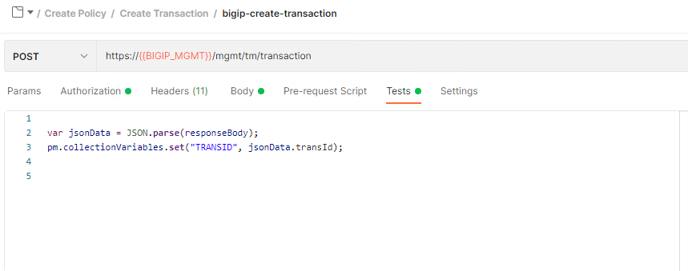
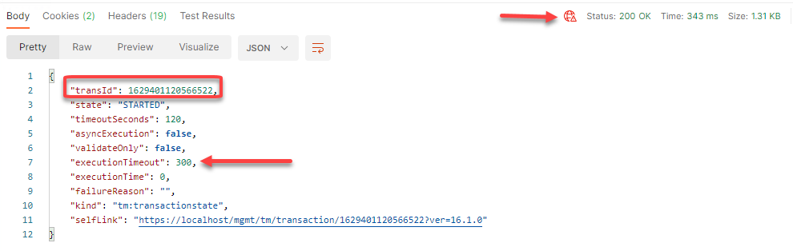
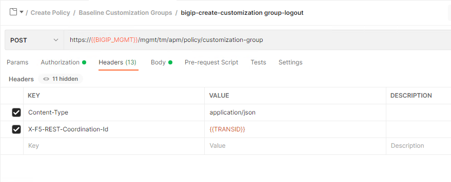
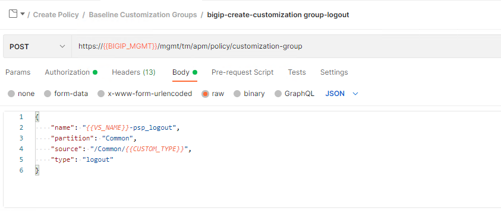

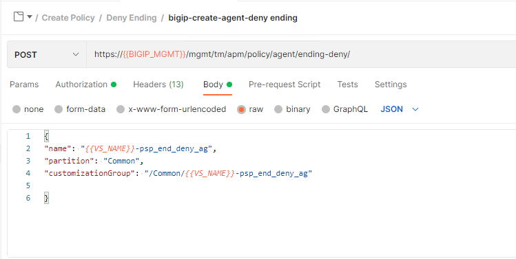
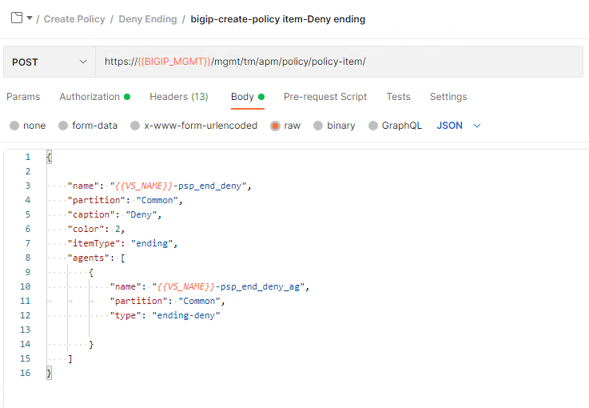
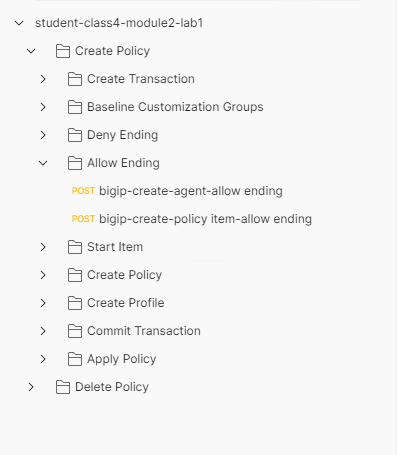
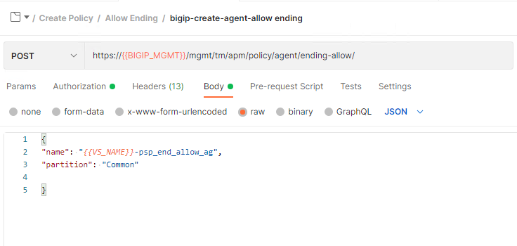
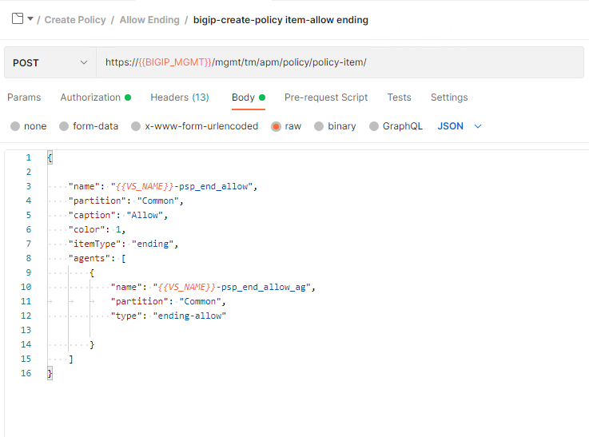
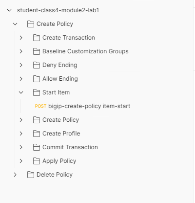
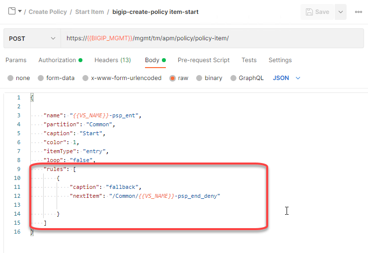
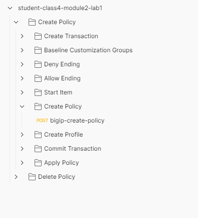
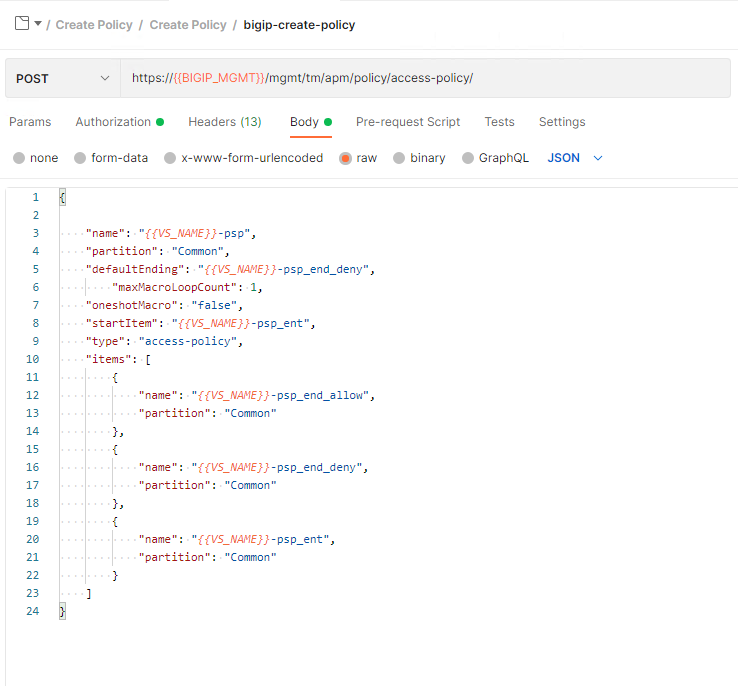
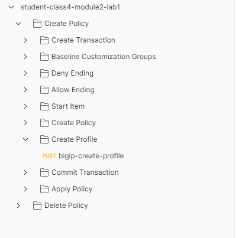
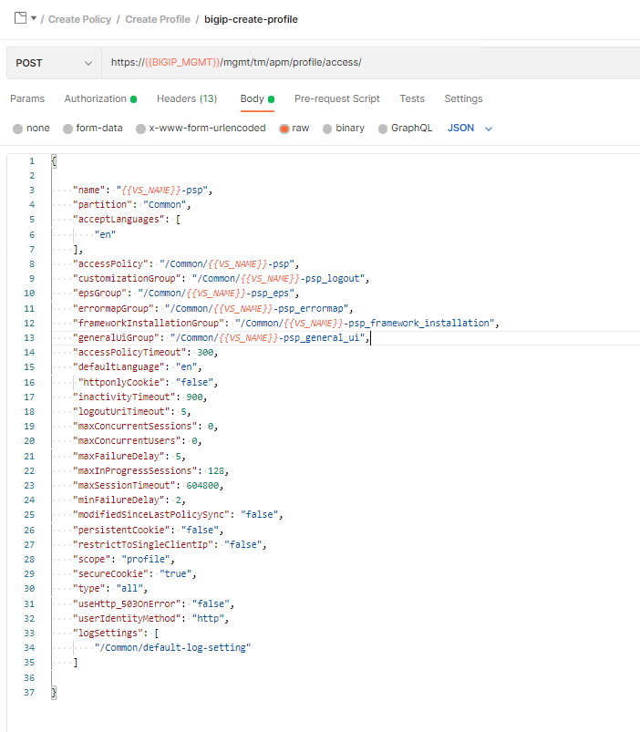
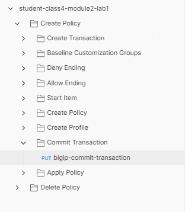
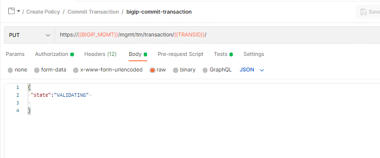
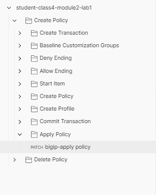
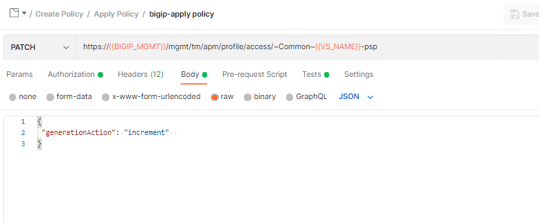
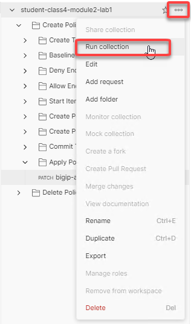
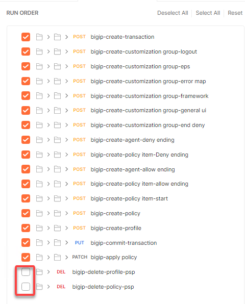
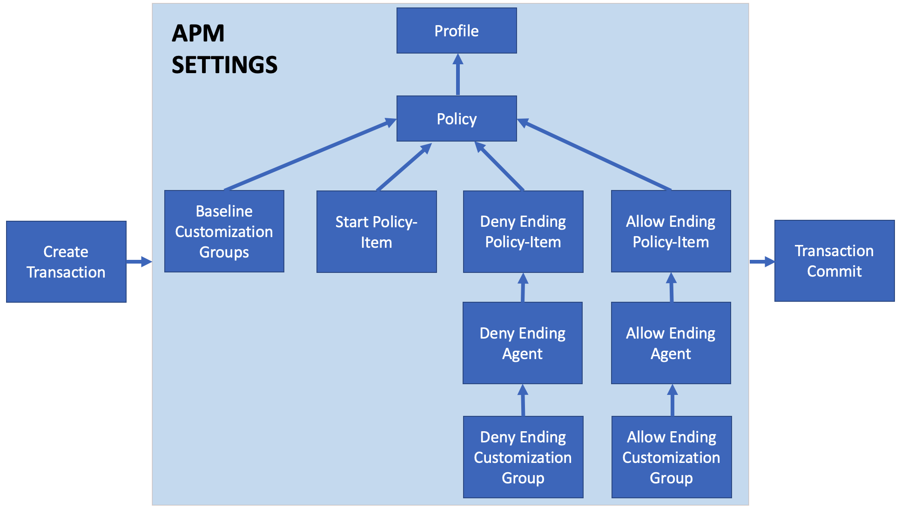

