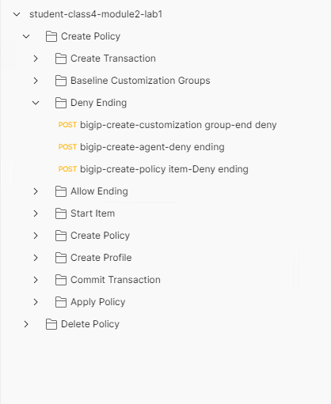
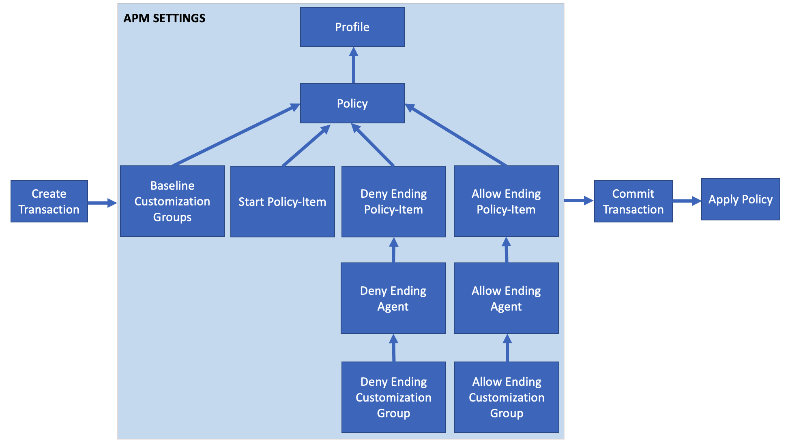

Lab 1: Create a Empty Per-Session Policy
==========================================

In this lab your will learn about the API calls necessary to build an clean Access Policy as if you had clicked create from GUI.  The Graphic below depicts the basic flow required for creating a policy via API.

    |image100|

Task 1 - Import Postman Collections
-----------------------------------------------------------------------

#. From the Jumpbox, open **Postman** via the desktop shortcut or toolbar at the bottom

    |image001|

#. Click **Yes** if prompted for "Do you want to allow this app to make changes to your device?"

    |image002|

#. Click **Import** located on the top right of the Postman application

    |image003|

#.  Click **Upload Files** 

    |image004|

#. Navigate to C:\access-labs\class4\module2\student_files, select **student-class4-module2-lab1.postman_collection.json**, and click **Open**

    |image005|

#.  Click **Import**

    |image006|

#. A collection called **student-class4-module1-lab1** will appear on the left side in Postman

Task 2 - Explore the icontrolRest Endpoints
-----------------------------------------------------------------------

#. Expand the **student-class4-module2-lab1** collection to see the subfolders to see the request in the **Create Transaction** folder.

    |image007|

#.  Click on the request **bigip-create-transaction**

    ..note::  When creating or modifying a policy it must be performed within a transaction.  A transaction occurs in multiple steps.  First you create the transation by receiving a transaction ID from the BIG-IP.  Next, you pass subsequent requets along with the transaction ID to the BIG-IP.  The BIG-IP does not process these requests.  Instead it holds those requests until the the transaction is commited in it's final step.  It's important to understand that transactions have an all or nothing approach.  Either every request in the transaction is process sucessfully or none of them are.  For APM polciese this is extremely important to ensure Policies contain all the necessary information to buid a working policy.

#. Click on Body.   Notice the only thing in body are open and close curly braces

    |image008|

#. Click on Tests.  In Postman Tests are performed after the response from the endpoint is retreived.  This javascript parses the response body for the transId and saves it as a variable for use in subsequent requests.

    |image009|

#. Click the blue **send** button in the upper right corner.

#. You will receive a 200 OK.  The response body contains the transaction ID. Also, notice that there is a default timeout value of 300 seconds for the transaction to complete.

    |image010|

#. Expand the **Baseline Customization Groups** subfolder.  There are five customization groups created anytime a APM Per-Session Policy is created and they are mandatory. A customization Group defines the look of a particualar object such as the different between the logout page prior 15.0. Not all policy-items have a customization group.  The best way to think about it is if the object is enduser facing or not.  All enduser facing items such as logon pages, webtops, logout pages all have customization groups.  Where as something such as a Active Directory Authenticatino will not.

#. Click **bigip-create-customization group-logout**

#. Click on **Headers**.  Notice there is header inserted into the request call **X-F5-REST-Coordination-Id** that references a Postman variable.  That variable contains the transId stored from the previous **bigip-create-transaction** request.  All Requests inside the transaction MUST have that header except for the last request that commits the transaction

    |image011|

#. Cick on the body of the Customziation is done by setting the **source** key to either **/Common/modern** or **/Common/standard**. This lab uses a Postman variables that references **/Common/modern**.

    |image012|

#. The four remaining requests in Baseline customization Groups subfolder all look the same except the value of the key **type** is different.  If click through you will notice they all hit the same endpoint of **/mgmt/tm/apm/policy/customization-group**

#. Expand the **Deny Ending** subfolder

    |image013|

#.  Notice that to create a single ending in the policy it takes three requests.  A good rule of thumb is going to be that for every object that you would build in manually in Visual Policy Editor that it will takes threee Requests.  First one defines the **customiztion group**, the second to define and **agent** and the third to define the **policy-item**.  

#. Click **bigip-create-customization group-end Deny**.  This customization group request is same as all previous requests except for the name and the value of the **type** key is **logout**

#. Click *bigip-create-agent-deny ending**.  The easiest way to descibe an agent is it contains the operatinal settings for that object. For example an AD authentication agent would contain the list of AD servers to be used or with a SAMl Agent it would contain the SAML Service Provider to be used.  In the case of a ending it will contain the previously defined customization group.

#. Notice the endpoint is **/mgmt/tm/apm/policy/agent/ending-deny**. Each agent type has it's own endpoint unlike customiztion groups.  

    |image014|

#. Click **bigip-create-policy item-Deny ending**.  A Policy-Item typically contains all the setting related to its placement in the flow such as branch rules. Since this is an ending we will not see any branch rules but see references to this policy-item after a few more steps. Additional settings of how the ending is displays in Visual Policy Editor are also specified here such as caption and color. Lastly there will always be a reference to an Agent via it's name.  You can see the name of the agent specificed is the agent we created in the previous request.

    |image015|

#. Expand the **Allow Ending** subfolder

    |image016|

#. Notice there is only an agent and policy-item.  There is not a customization group.  That's because if the connection is allowed the user will not be see any displayed from APM.  This example of a policy item of an object that is not end user facing.

#. Click **Body**.  Notice the only of the allow allow agent only contains the name and partition.

    |image017|

#. Click **bigip-create-policy item-allow ending**.  Then, click **Body**.
    
#. The stucture of the allow ending is similiar to the previous deny ending.  Since this is an ending it doesn't contain any branch rules.  

    |image018|

#. Expand the **Start Item** subfolder and notice their is only a single request.  There is not an agent or customization group required for the start-item.

    |image019|

#. Click **bigip-create-policy item-start** and then **Body**

#. Notice the **Rules** key.  The Rules key defines the branch rules for a policy-item.  All Policy-tems except for terminal endpoints must be used connected inside the policy via a rule condition.  In this case, the Start policy item connects to the Deny Terminal.    Secondly,  notice the **Rules** JSON key is an array because of the brackets.  This will allow someone to define multiple branch rules using expressions.  Such as with authenticaiton having a success and failure branch.  This will be covered more in depth in future labs.

    |image020|

#. Expand the **Create Policy** subfolder

    |image021|

#. Click **bigip-create-policy** and then **Body**

#. In order to create a policy all of the policy items used inside the policy MUST be inside the **items** JSON key array.  In this case we are only building a empty policy so only three items are defined.  The Start Item, Deny Terminal, and Allow Terminal.

    |image022|

#.Expand the **Create Profile** subfolder.

    |image023|

#. Click **bigip-create-profile** and then **Body**.   It contains the various setting related to timers, sessions, logging.  Notice the body also contains the five baseline customization groups defined at the beginning of the collection.

    |image024|

#. Expand the **Commit Transaction** subfolder.

    |image025|

#. Click **bigip-commit-transaction** and then **Body**.

#. Notice the request is sent to the endpoing **/mgmt/tm/transaction/** along with the transactionID with the Method PUT.  The body contains the key **state** with the value **VALIDATING**,  This starts the processing all the requests that contain the transationID.  After the transaction is commpleted, you will recieve a 200 OK.  If you receive another statecode one or more of the requests in the transaction could not be completed.

    |image026|

#. Expand the **Apply Policy** subfolder.

    |image027|

#. Click **bigip-apply Policy** and then **Body**

#. The Request is sent to the endpoint **/mgmt/tm/apm/profile/access/** using the PATCH Method.  When a patch is sent to the endpoing of the profile with the JSON body **"generationAction": "incremenet" is instructed the BIG-IP that you want to Apply Policy.

    |image028|

Task 3 - Create your first policy using automation
-----------------------------------------------------------------------  

#.  Now that we have walked through all the components required to create a policy through automation we will use Postman Runner to create it.

#.  Hover over the Collection name **student-class4-module2-lab1** with your mouse and click the **Arrow** icon.

    |image029|

#. Click the **Create Policy** folder

    |image030|

#. Click **Run** and Postman Runner will open.

    |image031|

#. Click Run **Run student-class...** and the API requests  will start being sent the BIG-IP.

    |image032|

#. The **Passed** circle will will contain only two passed even through there were more requests than two.  That is because of how Postman works.  The only items that show as either passed or failed will only be those requests that contain Test Conditions.  In the case of this example only the Commit Transaction request and the Apply Policy request contain tests.  If you don't write test conditions you would need to scroll through all the requests to see if any of them contained something other than 200 OK.

    |image033|

#. Open a browser and navigate to https://bigip1.f5lab.local

#. Login to the BIG-IP GUI with the following credentials:
    - Username: **admin**
    - Password: **admin**

#. Naviagate to Access>>Profiles/Policies>>Access Profiles (Per-Session Policies).  Do not click the plus symbol.

    |image034|

#. The policy you created via automation is displayed.  Click **Edit**.

    |image035|

#.  The policy is empty as planned.  This collection is the baseline for anything anything in APM regarless of how basic or complex the Access Policy is.

    |image036|

Task 3 - Delete the Access Profile 
----------------------------------------------------------------------- 

#. From Postman, Expand the **student-class4-module2-lab1 subfolder.

    |image037|

#.  The first thing you notice is it takes fewer requests to delete a policy than it does to create it.    In order to delete a policy you need to first delete the profile and then the policy. 

#. Click **bigip-delete-profile-psp**.  To delete a profile you send a request using the DELETE method to the /mgmt/tm/apm/profile/access endpoint along with the Parition and profile name.

    |image038|

#. Click the blue **send** button in the upper right corner.  You will receive a 200 OK response.  This is an indication that profile was found and deleted.

#. Click **bigip-delete-policy-prp.  To delete a profile you send a request using the DELETE method to the /mgmt/tm/apm/policy/access-policy endpoint along with the partition and policy name.

#. Click the blue **send** button in the upper right corner.  You will receive a 200 OK response.  This is an indication that policy was found and deleted.

#. Open a browser and navigate to https://bigip1.f5lab.local

#. Login to the BIG-IP GUI with the following credentials:
    - Username: **admin**
    - Password: **admin**

#. Naviagate to Access>>Profiles/Policies>>Access Profiles (Per-Session Policies).  Do not click the plus symbol.

    |image034|

#. The Policy has been successfully deleted.

    |image040|

This concluded the lab on building an empty Access Policy

    

.. |image001| image:: media/lab01/001.png
.. |image002| image:: media/lab01/002.png
.. |image003| image:: media/lab01/003.png
.. |image004| image:: media/lab01/004.png
.. |image005| image:: media/lab01/005.png

.. |image007| image:: media/lab01/007.png
.. |image008| image:: media/lab01/008.png

.. |image014| image:: media/lab01/014.png
.. |image015| image:: media/lab01/015.png
.. |image016| image:: media/lab01/016.png
.. |image017| image:: media/lab01/017.png
.. |image018| image:: media/lab01/018.png

.. |image020| image:: media/lab01/020.png

.. |image023| image:: media/lab01/023.png

.. |image026| image:: media/lab01/026.png
.. |image027| image:: media/lab01/027.png

