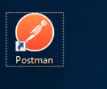
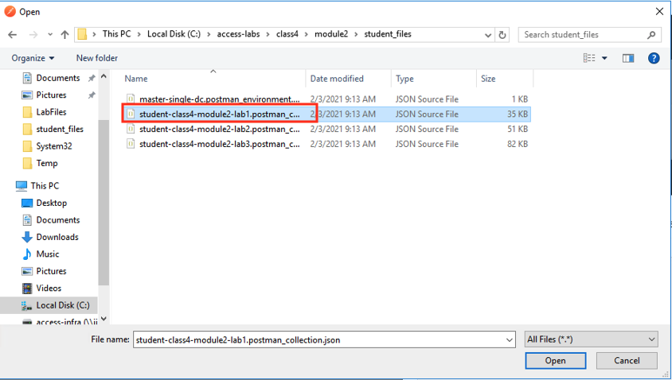

Lab 1: Create a Empty Per-Session Policy
==========================================

In this lab your will learn about the API calls necessary to build an clean Access Policy as if you had clicked create from GUI.

Task 1 - Import Postman Collections
-----------------------------------------------------------------------

#. From the Jumpbox, open **Postman** via the desktop shortcut or toolbar at the bottom

    |image001|

#. Click **Yes** if prompted for "Do you want to allow this app to make changes to your device?"

    |image002|

#. Click **Import** located on the top right of the Postman application

    |image003|

#.  Click **Upload Files** 

    |image004|

#. Navigate to C:\access-labs\class4\module2\student_files, select **student-class4-module2-lab1.postman_collection.json**, and click **Open**

    |image005|

#.  Click **Import**

    |image006|

#. A collection called **student-class4-module1-lab1** will appear on the left side in Postman

Task 2 - Explore the icontrolRest Endpoints
-----------------------------------------------------------------------

#. Expand the **student-class4-module2-lab1** collection to see the subfolders and requests.

    |image007|

#.  Click on the request **bigip-create-transaction**

..note::  When creating or modifying a policy it must be performed within a transaction.  A transaction occurs in multiple steps.  First you create the transation by receiving a transaction ID from the BIG-IP.  Next, you pass subsequent requets along with the transaction ID to the BIG-IP.  The BIG-IP does not process these requests.  Instead it holds those requests until the the transaction is commited in it's final step.  It's important to understand that transactions have an all or nothing approach.  Either every request in the transaction is process sucessfully or none of them are.  For APM polciese this is extremely important to ensure Policies contain all the necessary information to buid a working policy.

.. |image002| image:: media/lab01/002.png
.. |image003| image:: media/lab01/003.png
.. |image004| image:: media/lab01/004.png

.. |image006| image:: media/lab01/006.png
.. |image007| image:: media/lab01/007.png

.. |image009| image:: media/lab01/009.png
.. |image010| image:: media/lab01/010.png
.. |image011| image:: media/lab01/011.png
.. |image012| image:: media/lab01/012.png
.. |image013| image:: media/lab01/013.png

.. |image016| image:: media/lab01/016.png

.. |image019| image:: media/lab01/019.png

.. |image021| image:: media/lab01/021.png
.. |image022| image:: media/lab01/022.png

.. |image024| image:: media/lab01/024.png
.. |image025| image:: media/lab01/025.png

.. |image028| image:: media/lab01/028.png
.. |image029| image:: media/lab01/029.png
.. |image030| image:: media/lab01/030.png

