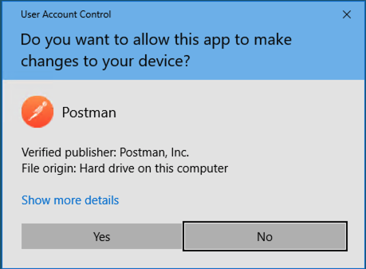
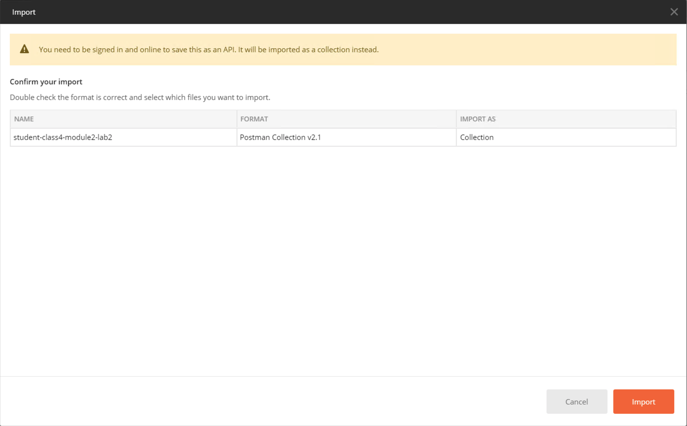
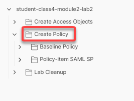
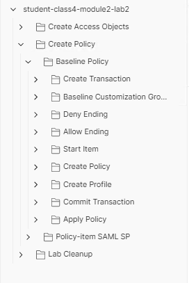
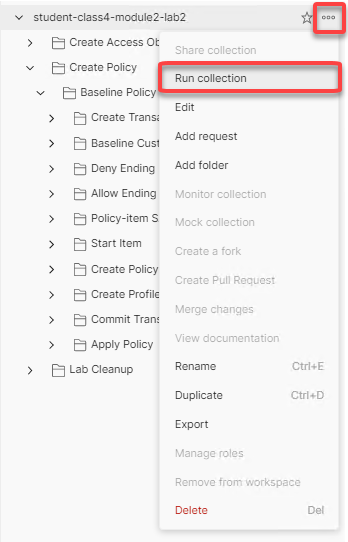
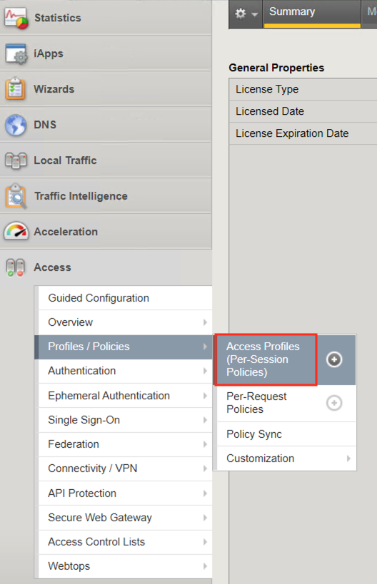
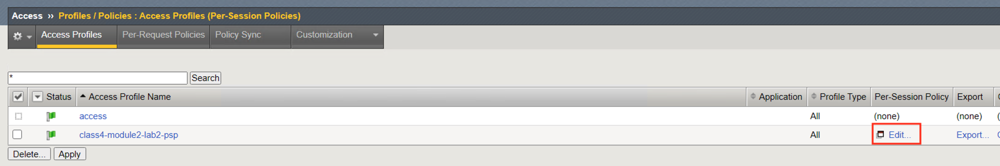
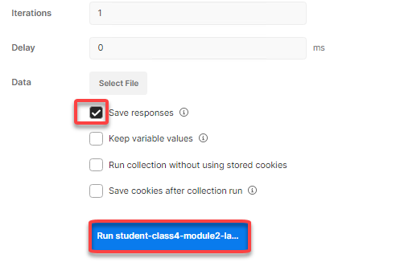
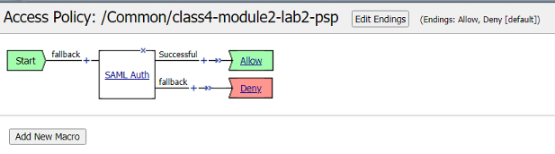

Lab 2: Create a SAML SP Per-Session Policy
==============================================

In this lab your will learn about the API calls necessary to build an Access Policy .  The Graphic below depicts the basic flow required for creating a policy via API.

    |image100|

Task 1 - Import Postman Collections
-----------------------------------------------------------------------

#. From the Jumpbox, open **Postman** via the desktop shortcut or toolbar at the bottom

    |image001|

#. Click **Yes** if prompted for "Do you want to allow this app to make changes to your device?"

    |image002|

#. Click **Import** located on the top right of the Postman application

    |image003|

#.  Click **Upload Files** 

    |image004|

#. Navigate to C:\access-labs\class4\module2\student_files, select **student-class4-module2-lab2.postman_collection.json**, and click **Open**

    |image005|

#.  Click **Import**

    |image006|

#. A collection called **student-class4-module1-lab2** will appear on the left side in Postman

Task 2 - Create Required SAML Objects
-----------------------------------------------------------------------

#. Expand the **student-class4-module2-lab2** collection and **Create Access Objects** folder.  These requests will import the IDP signing certificate, create a IdP Connector, and also the SP Service.  If you are unfamiliar with these requests please see :ref:`Creating a SAML Service Provider(SP) Service <class4-module1-lab1>` for more detail.

    |image007|

#.  Hover over the Collection name **student-class4-module2-lab2** with your mouse and click the **Arrow** icon.

    |image008|

#. Click the **Create Access Objects** folder. You will see the four requests in the folder.

    |image009|

#.  Click **Run** and Postman Runner will open.

    |image010|

#. Click  the blue button **Run student-class...** and the API requests will start being sent to the BIG-IP.

    |image011|

#. The **Pass** circle will display only a value of four.   
    
    |image012|

Task 3 - Create a SAML SP policy
-------------------------------------------

#. Expand the **student-class4-module2-lab2** collection and **Create Access Objects** folder.  These requests will import the IDP signing certificate, create a IdP Connector, and also the SP Service.  If you are unfamiliar with these requests please see lab XXXXX for more detail.

    |image013|

.. |image001| image:: media/lab02/001.png

.. |image004| image:: media/lab02/004.png
.. |image005| image:: media/lab02/005.png

.. |image008| image:: media/lab02/008.png

.. |image011| image:: media/lab02/011.png

.. |image014| image:: media/lab02/014.png

.. |image016| image:: media/lab02/016.png

.. |image023| image:: media/lab02/023.png
.. |image024| image:: media/lab02/024.png

.. |image031| image:: media/lab02/031.png
.. |image032| image:: media/lab02/032.png

